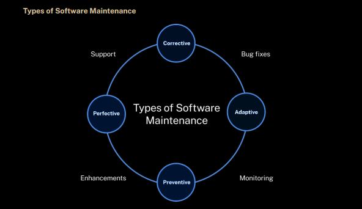
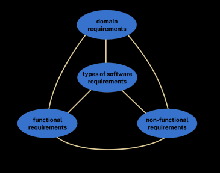
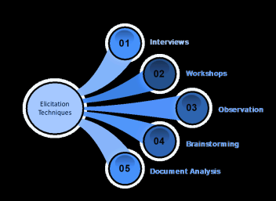
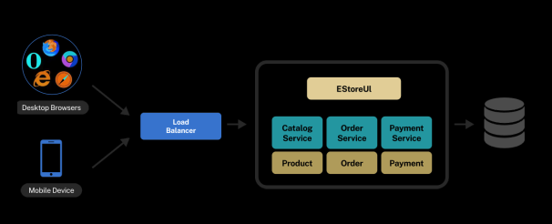
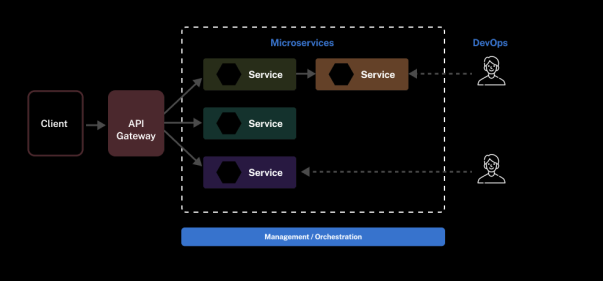
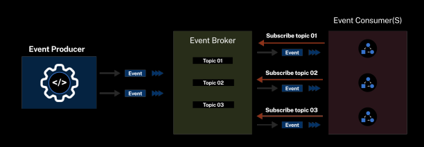
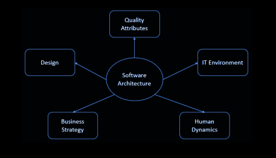
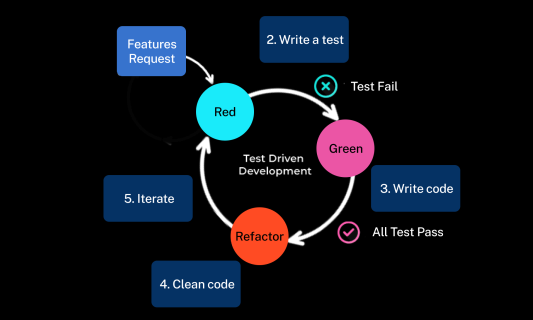
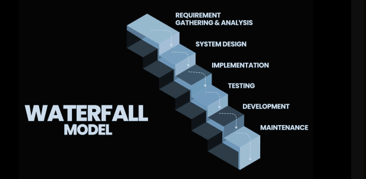
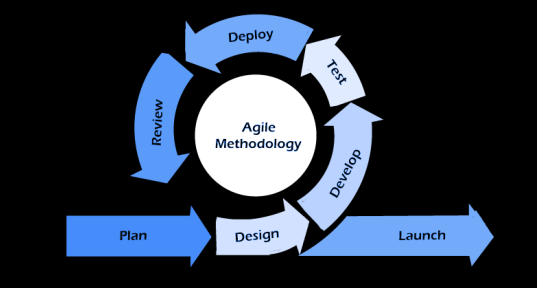

# SPM Notes

# 2nd Insem

# Lecture 22

## **1. Software Maintenance**

**Software maintenance** refers to the activities involved in modifying and updating software after its initial release. This ensures the software remains functional, up-to-date, and efficient throughout its lifecycle.

### **Types of Software Maintenance**
1. **Corrective Maintenance**: This involves fixing defects or bugs found in the software after deployment. It aims to restore the system to its desired functionality by eliminating issues that may affect its performance or cause unexpected behavior.
2. **Adaptive Maintenance**: This type focuses on modifying the software to ensure compatibility with new environments such as new operating systems, hardware, or third-party software. It helps the software remain functional in an evolving technological landscape.
3. **Perfective Maintenance**: This maintenance is focused on improving the software's performance, usability, or maintainability. It often results from user feedback or the need to enhance the system’s capabilities.
4. **Preventive Maintenance**: It involves making proactive changes to the software to prevent future problems. Activities like code refactoring, performance optimization, and security updates fall under this category.

### **Reasons for Software Maintenance**
- **Correcting Defects**: Software maintenance is crucial for fixing bugs or issues missed during development or arising from changes in the system’s environment.
- **Enhancing Functionality**: Software must evolve with changing user needs. Maintenance allows adding features or modifying existing ones to adapt to these needs.
- **Improving Performance**: Over time, software may suffer from performance degradation. Maintenance efforts help in optimizing performance and resource utilization.
- **Adapting to Changing Environments**: Software must evolve to remain compatible with new OS, hardware, or third-party libraries.
- **Extending Lifecycle**: Through effective maintenance, software can remain useful and valuable for a longer period, thus providing ongoing support to its users.

---

## **2. Activities Involved in Software Maintenance**

These activities are aimed at ensuring the software continues to function effectively and meet user expectations after it has been deployed.

1. **Bug Tracking and Fixing**: This involves identifying and resolving defects reported by users or found through testing. It’s a vital task for maintaining system stability and reliability.
2. **Enhancements and Upgrades**: Over time, user needs evolve. Maintenance includes adding new features, improving existing ones, and adapting the system to meet new business requirements.
3. **Code Refactoring**: This process involves restructuring the code to improve readability, maintainability, and performance without changing its external behavior. It helps in reducing technical debt and enhancing code quality.
4. **Compatibility Updates**: Software must be updated to work seamlessly with newer operating systems, hardware, or third-party libraries. This ensures continued operation in a changing tech environment.
5. **Performance Optimization**: Over time, the performance of software may degrade due to increased data or usage. Maintenance efforts focus on optimizing the software for better speed, efficiency, and resource utilization.

---

## **3. Software Project Management (SPM)**

**Software Project Management** is the practice of planning, organizing, and managing software projects. It ensures that the project meets its goals, stays within budget, and is completed on time.

### **Aspects of Software Project Management**
1. **Planning**: This is the initial phase of project management, where a detailed blueprint of the project is developed. It includes defining scope, resources, timelines, testing, and maintenance strategies.
2. **Leading**: The project manager leads and coordinates a team of developers, designers, and other stakeholders to ensure the project is on track. Leadership requires excellent communication, interpersonal skills, and decision-making abilities.
3. **Execution**: This phase involves the actual implementation of the project. It includes monitoring progress, managing resources, and ensuring that each stage of the project is completed successfully.
4. **Time Management**: Managing time effectively is crucial, especially in software projects where changes in scope or technical challenges can impact the timeline. Proper risk mitigation and contingency planning are essential to handle such challenges.

---

## **4. Project Management Process**

This process defines how software projects are planned, executed, and terminated. It ensures the project meets its objectives efficiently.

### **Stages**
1. **Feasibility Study**: This stage assesses whether the project is viable from technical, operational, and economic perspectives. The feasibility study helps determine if the project should proceed or not.
2. **Project Planning**: In this phase, detailed planning occurs, including setting objectives, allocating resources, defining strategies, and developing the project schedule.
3. **Project Execution**: This phase involves carrying out the planned activities, including design, coding, and testing. It’s where the project’s actual development happens.
4. **Project Termination**: At this stage, the project concludes either after successful completion or when it is halted due to unmet requirements or constraints.

### **Phases of Project Management**
- **Initiation**: Defining the project, its goals, and identifying stakeholders.
- **Planning**: Defining the scope, objectives, and identifying resources.
- **Execution**: Implementing tasks, allocating resources, and controlling progress.
- **Monitoring and Control**: Ensuring the project stays on track by comparing actual progress with planned objectives.
- **Closing**: Finalizing and completing the project, documenting results, and closing issues.

---

## **5. Project Size Estimation Techniques**

Estimation techniques are critical for predicting the size, effort, cost, and time required for a software project. They guide decision-making and resource allocation.

1. **Expert Judgment**: Estimation based on the knowledge and experience of experts in the field. This method is useful when there is little historical data or the project is unique.
2. **Analogous Estimation**: This technique compares the current project with similar completed projects. It’s based on historical data and previous experiences.
3. **Bottom-up Estimation**: The project is divided into smaller tasks or modules, and each one is estimated separately. The sum of these estimates provides the overall project estimate.
4. **Three-point Estimation**: Estimates are made using three values: optimistic, pessimistic, and most likely. The expected size is calculated using a weighted average or the PERT formula.
5. **Function Points**: This technique estimates project size based on the system's functionalities, such as the number of inputs, outputs, and data files involved.

---

## **6. Configuration Management in Maintenance**

Configuration management ensures the integrity of software products by managing changes systematically and tracking them throughout their lifecycle.

1. **Identification and Establishment**: Identifying configuration items and defining relationships among them. This helps in managing versions and changes more efficiently.
2. **Version Control**: Managing different versions of software artifacts, ensuring developers can track changes and collaborate without conflict.
3. **Change Control**: The process of managing and tracking changes made to software items, ensuring they align with project goals.
4. **Configuration Auditing**: Auditing ensures that configuration items are complete, consistent, and correct. It checks the accuracy of changes and tracks any deviations from the baseline.
5. **Reporting**: Providing detailed reports on the status of configurations and changes. It ensures stakeholders are informed about the project's configuration and status.

---

## **7. COCOMO Model**

The **COCOMO Model** is a cost estimation model used to predict the effort, time, and cost involved in a software development project based on its size (measured in Lines of Code - LOC).

1. **Basic COCOMO**: A simple model for quick estimates based on project size.
2. **Intermediate COCOMO**: Adds more project attributes for a more refined estimate.
3. **Detailed COCOMO**: The most comprehensive model, considering detailed aspects of the project, including personnel capabilities and project complexity.

**System Types**:
- **Organic**: Small, simple projects with a familiar problem and a small team.
- **Semi-detached**: Projects with moderate complexity requiring a larger, more skilled team.
- **Embedded**: Highly complex projects requiring advanced skills, large teams, and extensive experience.

---

## **8. Capability Maturity Model (CMM)**

**CMM** is a framework to assess and improve software development processes in an organization. It defines five maturity levels that indicate how well the organization manages software development.

### **Levels of Maturity**
1. **Initial**: Processes are unpredictable, and success depends on individual efforts.
2. **Repeatable**: Project management processes are established, and previous successes can be repeated.
3. **Defined**: Processes are documented and standardized across the organization.
4. **Managed**: Quantitative measures are used to manage software processes.
5. **Optimizing**: Focus on continuous process improvement using feedback and innovation.

---

## **9. Software Evolution**

Software **evolution** refers to the continuous development of software to adapt to changing user needs, new technologies, and emerging competitive pressures. It ensures that software remains relevant, secure, and efficient.

---

## **10. Software Reengineering**

Software **reengineering** involves restructuring existing software to improve its performance, maintainability, and adaptability. It includes activities such as code analysis, reverse engineering, and refactoring.

### **Advantages**
- Improved maintainability
- Increased performance
- Adaptation to new technologies

### **Disadvantages**
- Incomplete understanding of the existing code
- Risk of introducing new defects
- Disruption to current users

---

## **11. Impact Analysis**

Impact analysis is crucial for understanding how proposed changes will affect the software. It helps in planning for changes, managing risks, and ensuring the overall stability of the software.

---

## **12. Regression Testing**

**Regression testing** ensures that recent changes in the software have not negatively impacted existing functionalities. It involves rerunning test cases that cover critical features.

### **Best Practices**
- **Test Automation**: Automate regression tests for consistency and efficiency.
- **Continuous Integration**: Incorpor

ate regression testing into the continuous integration pipeline.

---

## **13. Software Documentation**

Proper **documentation** is essential for ensuring that software is maintainable, understandable, and usable. It supports changes, bug fixes, and future enhancements.

### **Types of Documentation**
1. **Requirements Documentation**: Describes the functional and non-functional requirements of the software.
2. **Design Documentation**: Explains the software’s architecture and modules.
3. **Code Documentation**: Provides in-code comments to explain the logic behind functions and classes.
4. **User Documentation**: Provides instructions for end-users on how to use the software.

---

Here are the topics that were missed from the original notes:

---

### **Challenges in Software Maintenance**  
1. **Understanding Legacy Code**: Legacy code often lacks proper documentation or uses outdated languages, making it difficult to comprehend and modify.  
2. **Impact Analysis**: Analyzing the ripple effect of changes on interconnected components is complex and may lead to unintended consequences.  
3. **Time and Resource Constraints**: Maintenance tasks compete with new development projects for resources, which can delay addressing issues.  
4. **Regression Issues**: Fixing one defect may introduce new ones, necessitating rigorous regression testing.  
5. **Lack of Documentation**: Outdated or incomplete documentation makes it harder to understand dependencies and maintain the system.

---

### **Overview of the Software Maintenance Process**
1. **Maintenance Request Submission**: Users, stakeholders, or internal teams submit maintenance requests, including bug reports, feature enhancements, and performance updates.  
2. **Maintenance Request Analysis**: Requests are evaluated for feasibility, alignment with software goals, and impact.  
3. **Impact Analysis**: Analyzing the proposed changes' effect on codebase, dependencies, and interactions.  
4. **Effort Estimation**: Estimating resources, time, and effort needed for implementation.  
5. **Approval and Prioritization**: Requests are approved and ranked based on criticality and urgency.

---

### **Maintenance Request Handling**
1. **Logging and Tracking**: Requests are logged in a system to monitor their progress.  
2. **Prioritization**: Requests are ranked based on urgency and impact, addressing critical issues first.  
3. **Assignment**: Tasks are assigned to team members with relevant expertise.  
4. **Communication**: Stakeholders are updated regularly on the status of maintenance requests.  
5. **Status Updates**: Progress reports are shared with all involved parties.

---

### **Software Configuration Management in Maintenance**
1. **Version Control**: Tracks changes in source code and other artifacts to prevent conflicts and enable collaboration.  
2. **Change Tracking**: Logs all changes for better transparency and tracking.  
3. **Configuration Identification**: Labels and identifies configuration items for organized management.  
4. **Baseline Management**: Maintains stable software baselines before and after major changes.  
5. **Change Control Boards (CCBs)**: Reviews and approves proposed changes to ensure alignment with business objectives.

---

### **Impact Analysis and Change Management**
1. **Identify the Change**: Clearly define what needs to be modified.  
2. **Identify Affected Areas**: Analyze dependencies and impacted components.  
3. **Assess Impact**: Evaluate how the change affects functionality, performance, and security.  
4. **Identify Risks**: Highlight potential risks, such as introducing defects or breaking existing functionalities.  
5. **Plan Mitigation Strategies**: Develop measures to minimize risks and ensure successful implementation.

---

### **Regression Testing**
1. **Test Case Selection**: Identify and rerun critical test cases.  
2. **Test Automation**: Automate repetitive tests for efficiency.  
3. **Continuous Integration**: Run tests as part of the CI/CD pipeline to detect issues early.  
4. **Version Control**: Track code changes for better test association.  
5. **Prioritization**: Focus on high-impact areas during testing.

---

### **System Configuration Management**
1. **Identification and Establishment**: Define and manage configuration items.  
2. **Version Control**: Track and manage versions to facilitate updates and collaboration.  
3. **Change Control**: Ensure all changes are systematically assessed and approved.  
4. **Configuration Auditing**: Verify the correctness and completeness of changes.  
5. **Reporting**: Provide updates and insights to stakeholders about system configurations.

---

### **Software Evolution**
- **Definition**: Continuous adaptation of software to changing needs, technologies, and user expectations.  
- **Examples**: Microsoft Windows, Google Maps, Apache HTTP Server.

---

### **Techniques in Software Reengineering**
1. **Reverse Engineering**: Analyze existing code to understand its structure and functionality.  
2. **Refactoring**: Improve code quality without altering its external behavior.  
3. **Replatforming**: Transition software to newer platforms for enhanced compatibility.  
4. **Re-architecting**: Redesign the architecture to improve scalability and maintainability.  
5. **Data Migration**: Transfer data during reengineering or system upgrades.

---

### **COCOMO Models**
1. **Basic COCOMO**: Estimates effort and time for small, straightforward projects.  
2. **Intermediate COCOMO**: Includes additional factors like team skill and project complexity.  
3. **Detailed COCOMO**: Provides a more granular estimation by analyzing sub-systems and other detailed attributes.

---

### **Capability Maturity Model (CMM) Levels**
1. **Initial**: Ad hoc processes with unpredictable outcomes.  
2. **Repeatable**: Basic project management practices in place.  
3. **Defined**: Standardized and documented processes across the organization.  
4. **Managed**: Quantitative quality goals and measurements guide projects.  
5. **Optimizing**: Continuous process improvement driven by feedback and innovation.

---

# Lecture 24

Here are the concise and structured notes for **Unit-4, Lecture 24** on **Software Requirement Specification (SRS):**

---

## **1. Introduction to Requirements**
- **Definition**: Requirements specify what a software system should achieve and how it should behave. They form the foundation of the software development lifecycle.  
- **IEEE Definition**:  
  - A condition or capability needed by a user to solve a problem or achieve an objective.  
  - A condition or capability required to satisfy a contract, standard, or specification.  
  - A documented representation of such conditions or capabilities.

## **2. Types of Software Requirements**
1. **Functional Requirements**:  
   - Describe the functions a system must perform.  
   - Examples: Data manipulation, business processes, calculations, or specific user interactions.  
   - In hospital systems, this could include retrieving patient records.  

2. **Non-Functional Requirements**:  
   - Define system quality attributes such as performance, security, and usability.  
   - Example: A system must respond to user actions within 2 seconds.  

3. **Domain Requirements**:  
   - Specific constraints derived from the domain the system operates in.  
   - Example: Compliance with medical regulations in healthcare software.

---

## **3. Characteristics of Good Requirements**
1. **Clear**: Easily understood by all stakeholders.  
2. **Complete**: Covers all aspects of the intended functionality.  
3. **Consistent**: Free from contradictions.  
4. **Testable**: Measurable and verifiable through testing.  
5. **Traceable**: Linked to their source and tracked throughout development.  
6. **Modifiable**: Flexible enough for updates without extensive rework.  

---

## **4. SRS Document Structure**
1. **Introduction**:  
   - Purpose, scope, and objectives of the system.  

2. **Functional Requirements**:  
   - Detailed descriptions of all user-visible features.  

3. **Non-Functional Requirements**:  
   - Quality attributes like performance, security, and scalability.  

4. **Use Cases**:  
   - Scenarios describing user interactions with the system.  

5. **Assumptions and Constraints**:  
   - Technical or business constraints impacting development.  

---

## **5. Importance of an SRS Document**
- Acts as a reference for developers, testers, and stakeholders.  
- Serves as a contract between developers and customers.  
- Facilitates better planning, resource allocation, and risk management.

---

# Lecture 25

The notes for **Unit-4, Lecture 4** on **Functional and Non-Functional Requirements** are summarized below:

---

## **1. Functional Requirements**
- **Definition**: These describe the specific functions or capabilities that a system should perform.  
- **Characteristics**:
  - Directly visible to users as outputs or interactions.
  - Define what the system does.
  - Include inputs, operations, and outputs.

### **Examples**:
1. In a hospital management system:
   - A doctor should retrieve patient information.
2. In a library system:
   - Users can search for books by title or author.
   - Borrowing and returning books functionality.

### **Expression Methods**:
- **Natural Language**: Informal descriptions in plain text.
- **Structured Format**: More organized with semi-formal syntax.
- **Formal Specification Language**: Precise and rigorous, with defined syntax.

---

## **2. Non-Functional Requirements**
- **Definition**: Describe the quality attributes or constraints of the system rather than functionalities.  
- **Also Called**: Non-behavioral requirements.  

### **Characteristics**:
- Affect the user experience and overall system performance.
- Vary in priority depending on project requirements.

### **Categories**:
1. **Performance**: Time response, scalability, and throughput under load.
2. **Security**: Access control, encryption, and data protection.
3. **Usability**: User-friendliness and interface design.
4. **Reliability**: System uptime and error tolerance.

### **Examples**:
1. A system must handle 1000 concurrent users without slowing down.
2. Passwords stored securely using encryption.

---

## **3. Domain Requirements**
- **Definition**: Specific to the domain or industry the software is designed for.  
- **Characteristics**:
  - Can be functional or non-functional.
  - Derived from the domain model rather than user preferences.

### **Examples**:
1. In academic software:
   - Must display a list of faculty or students by class.
2. In banking software:
   - Support for regulatory compliance (e.g., KYC).

---

## **4. Role of Requirements in Project Success**
1. **Clear Understanding**: Provides a shared understanding of the project scope and goals.  
2. **Stakeholder Alignment**: Ensures the software meets user and business needs.  
3. **Foundation for Planning**: Helps estimate effort, time, and cost accurately.  
4. **Risk Management**: Identifies risks early, enabling proactive mitigation.  
5. **Effective Communication**: Acts as a bridge between technical and non-technical stakeholders.

---

## **5. Requirements Elicitation**
- **Definition**: Process of gathering, refining, and defining software requirements.  

### **Activities**:
1. Understand the domain where the system is applied.
2. Investigate precise customer problems.
3. Define system constraints and user needs.

### **Methods**:
1. **Interviews**: Direct discussions with stakeholders.
2. **Surveys**: Gathering structured feedback from multiple users.

---

# Lecture 26

Here are the structured and concise notes for **Unit-4, Lecture 26** on **Software Architecture and Design Patterns**:

---

## **1. Software Architecture**
- **Definition**: High-level structure and organization of a software system. It involves design decisions about component interactions, data flow, and meeting system functionality and quality attributes.  
- **Purpose**: Acts as a blueprint to guide development, ensuring reliability, scalability, maintainability, and efficiency.

### **Importance of Architecture**
1. **Guidance and Direction**: Provides clear directions for design, technology, and implementation strategies.  
2. **Complexity Management**: Breaks down complex systems into manageable components.  
3. **Quality Attributes**: Directly impacts performance, scalability, reliability, maintainability, and security.  
4. **Cost and Time Efficiency**: Early focus prevents costly rework later.  
5. **Collaboration**: Aids communication between developers, testers, and other stakeholders.  
6. **Scalability and Flexibility**: Supports system growth and adaptation to changing needs.

### **Key Principles**
1. **Modularity**: Break systems into smaller components for easy development and testing.  
2. **Separation of Concerns**: Divide the system into distinct sections for better clarity and maintainability.  
3. **Abstraction and Encapsulation**: Hide implementation details to reduce dependencies.  

---

## **2. Architectural Patterns**
High-level templates that guide system design by providing solutions to common challenges.

### **Types of Architectural Patterns**
1. **Monolithic Architecture**:  
   - Single, tightly integrated unit.  
   - **Pros**: Simple to develop and deploy.  
   - **Cons**: Hard to maintain and scale as the application grows.

   

2. **Microservices Architecture**:  
   - System divided into small, independent services communicating via APIs.  
   - **Pros**: Scalability, flexibility, and fault isolation.  
   - **Cons**: Increased deployment and management complexity.

   

3. **Layered Architecture**:  
   - Organized into layers (e.g., presentation, business logic, data storage).  
   - **Pros**: Clear separation of concerns, modularity.  
   - **Cons**: Performance overhead and potential over-abstraction.

4. **Event-Driven Architecture**:  
   - Components communicate asynchronously through events.  
   - **Pros**: Loose coupling, real-time responsiveness.  
   - **Cons**: Complex debugging and event proliferation.

   

5. **Client-Server Architecture**:  
   - Division of responsibilities between a client and server.  
   - **Pros**: Commonly used for web applications.  
   - **Cons**: Server dependency for operation.

---

## **3. Design Patterns**
- **Definition**: Reusable solutions to common design problems in software development. They improve maintainability, scalability, and efficiency.  

### **Types of Design Patterns**
1. **Creational Patterns**: Manage object creation for flexibility and reuse.  
   - Examples: Singleton, Factory, Builder, Prototype.  

2. **Structural Patterns**: Focus on class composition for larger systems.  
   - Examples: Adapter, Composite, Decorator, Facade.  

3. **Behavioral Patterns**: Define object communication for functionality.  
   - Examples: Observer, Strategy, Command, State.  

### **Benefits**
1. **Reusability**: Saves time and effort across projects.  
2. **Maintainability**: Clear structure and modular design improve understanding.  
3. **Scalability**: Facilitates system growth and adaptability.  
4. **Best Practices**: Incorporates proven design strategies.  

---

# Lecture 27

Here are the structured and concise notes for **Unit-4, Lecture 27** on **Software Architecture and Error Handling**:

---

## **1. Software Architecture**
- **Definition**: Software architecture refers to the high-level design of a system, detailing its structure, components, and interactions. It serves as a blueprint for guiding development.  
- **Key Factors**: Includes considerations like business strategy, quality attributes, human dynamics, design principles, and the IT environment. 

### **Importance**
1. **Structural Integrity**: Ensures components integrate seamlessly.  
2. **Scalability**: Supports growing workloads and user demands.  
3. **Maintainability**: Simplifies identifying, isolating, and fixing issues.  
4. **Flexibility**: Adapts to evolving requirements or technologies.  
5. **Collaboration**: Facilitates teamwork by providing clear guidelines.

---

## **2. Common Architectural Styles**
1. **Monolithic Architecture**:  
   - Entire application built as a single unit.  
   - **Pros**: Simple to develop and deploy.  
   - **Cons**: Challenging to maintain and scale.  

2. **Microservices Architecture**:  
   - Divides applications into small, independent services.  
   - **Pros**: Scalability, flexibility, fault isolation.  
   - **Cons**: Complex to manage and deploy.  

3. **Client-Server Architecture**:  
   - Splits functionality between client (user interface) and server (backend).  
   - **Pros**: Modular and widely used.  
   - **Cons**: Dependency on server for operation.  

4. **Layered Architecture**:  
   - Organizes the system into layers (e.g., presentation, business logic, data).  
   - **Pros**: Clear separation of concerns.  
   - **Cons**: Can lead to over-abstraction and performance overhead.  

5. **Event-Driven Architecture**:  
   - Components interact by emitting and consuming events.  
   - **Pros**: Asynchronous, loosely coupled.  
   - **Cons**: Debugging and event management can be challenging.

---

## **3. Error Handling**
- **Definition**: The process of managing errors or exceptions to ensure the system remains functional and user-friendly.

### **Importance**
1. **Prevents Crashes**: Ensures errors don’t disrupt the system entirely.  
2. **Enhances User Experience**: Provides clear error messages to users.  
3. **Improves Security**: Protects against vulnerabilities arising from unhandled errors.  
4. **Facilitates Troubleshooting**: Helps developers identify and resolve issues.  

### **Types of Errors**
1. **Syntax Errors**: Violations of programming language rules. Example: Missing semicolons.  
2. **Runtime Errors**: Occur during execution due to unforeseen situations, like dividing by zero.  
3. **Logic Errors**: Faulty logic produces incorrect results despite successful execution.

---

## **4. Error Handling Mechanisms**
1. **Try-Catch Blocks**:  
   - Enclose risky code in a `try` block and handle exceptions in a `catch` block.  
   - Prevents crashes by catching and addressing specific errors.  

2. **Exception Propagation**:  
   - Exceptions not handled in one method propagate to the caller.  
   - Ensures errors are eventually caught or logged.

### **Best Practices**
1. **Effective Error Messages**:  
   - Provide clear, user-friendly messages with relevant context.  

2. **Logging and Monitoring**:  
   - Record errors for analysis and debugging.  

3. **Graceful Degradation**:  
   - Maintain partial functionality when parts of the system fail. Example: Displaying cached content if the database is unreachable.  

4. **Fallback Mechanisms**:  
   - Offer alternatives during failures, such as retrying or using backup services.  

5. **Circuit Breakers**:  
   - Stop repeated attempts to use failing components, allowing recovery time.

---

# Lecture 28

Here are the structured and concise notes for **Unit-4, Lecture 27**, based on the **Design Review Checklist Report**:

---

## **1. Importance of Design Reviews**
- **Definition**: Design reviews evaluate architectural and design decisions in software development.  
- **Significance**:
  1. **Early Issue Detection**: Identifies problems before implementation, reducing cost and effort.  
  2. **Quality Assurance**: Ensures adherence to best practices, standards, and project requirements.  
  3. **Risk Mitigation**: Detects and addresses potential risks in the design phase.  
  4. **Collaboration**: Promotes teamwork and knowledge sharing among stakeholders.  
  5. **Scalability and Security**: Evaluates the design's ability to handle growth and protect data.

---

## **2. Components of a Design Review Checklist**
1. **Architectural Decisions**:
   - Assess chosen architecture type (e.g., monolithic, microservices).  
   - Verify alignment with project goals and requirements.  

2. **Modularity and Components**:
   - Ensure clear separation of concerns.  
   - Verify proper organization of components/modules.

3. **Data Management**:
   - Review data storage and retrieval strategies.  
   - Validate the accuracy of data models representing business domains.

4. **Communication and Interfaces**:
   - Examine inter-component communication patterns and APIs.  
   - Check for consistency and clarity in interfaces.

5. **Scalability and Performance**:
   - Analyze load-balancing, caching, and handling peak loads.  
   - Evaluate performance-critical decisions like database queries.

6. **Security**:
   - Review mechanisms for authentication, authorization, and encryption.  
   - Ensure sensitive data is properly protected.

7. **Error Handling and Resilience**:
   - Assess exception management and recovery strategies.  
   - Verify fallback options and fault tolerance.

8. **Dependencies**:
   - Review external libraries and third-party components.  
   - Evaluate risks from dependency changes.

---

## **3. Strategies for Effective Design Reviews**
1. **Preparation**: Share relevant documents and diagrams with reviewers beforehand.  
2. **Clear Objectives**: Define goals and expected outcomes for the review.  
3. **Stakeholder Involvement**: Include developers, architects, and domain experts for well-rounded input.  
4. **Structured Agenda**: Follow a checklist to ensure comprehensive coverage.  
5. **Focused Sessions**: Allocate dedicated time for reviewing and discussing critical aspects.

---

## **4. Roles in Design Reviews**
1. **Reviewers**:
   - Experienced professionals evaluating architecture, design principles, and quality attributes.  
   - Provide constructive feedback to refine the design.

2. **Presenters**:
   - Showcase design decisions and rationale to reviewers.  
   - Address questions and justify choices.

---

## **5. Evaluating Functional and Non-Functional Requirements**
1. **Functional Requirements**:
   - Map design elements to functional requirements.  
   - Ensure completeness and traceability of requirements in the design.

2. **Non-Functional Requirements**:
   - Assess scalability, maintainability, and performance.  
   - Validate adherence to coding standards and documentation clarity.

---

# Unit 3

# Lecture 15

Here are the concise and structured notes for **Unit-3, Lecture 15** on **Introduction to Software Testing**:

---

## **1. Definition of Software Testing**
- **Software Testing**: A process of evaluating and verifying software to ensure it meets its intended requirements and functions correctly.  
- **Goal**: To identify defects, bugs, or errors and ensure software quality before release.

---

## **2. Purpose of Software Testing**
1. **Identifying Defects**: Detects coding errors, logical mistakes, and mismatches between expected and actual results.  
2. **Ensuring Quality**: Confirms software meets quality standards and functions correctly, leading to higher user satisfaction.  
3. **Validating Requirements**: Verifies that software fulfills specified requirements and business needs.  
4. **Reducing Maintenance Costs**: Early detection of defects reduces costs and effort in later stages.  
5. **Building Confidence**: Provides assurance to stakeholders about the reliability and correctness of the software.

---

## **3. Importance of Software Testing**
1. **Error Detection**: Identifies issues early, reducing rework and saving resources.  
2. **Quality Assurance**: Confirms adherence to specified standards and user expectations.  
3. **Risk Mitigation**: Minimizes the likelihood of software failures.  
4. **Customer Satisfaction**: Ensures trust and reliability, leading to a positive user experience.  
5. **Continuous Improvement**: Offers feedback for refining design and implementation.

---

## **4. Types of Software Testing**
### **Manual Testing**
- Performed without automation tools; focuses on user interaction and behavior validation.  
- **Subtypes**:
  1. **White Box Testing**:  
     - Focuses on internal structures like code paths, conditions, and loops.  
     - Ensures the logic and data flows work as expected.  
  2. **Black Box Testing**:  
     - Examines external functionalities without knowledge of internal code.  
     - Input-output validation is the primary focus.  
  3. **Gray Box Testing**:  
     - Combines both white box and black box techniques.  
     - Tests the system with some knowledge of its internals for broader coverage.

### **Automation Testing**
- Uses tools or scripts to execute test cases and validate software.  
- **Common Automation Tests**:
  1. **Unit Testing**: Tests individual components for correctness.  
  2. **Integration Testing**: Ensures modules work together seamlessly.  
  3. **System Testing**: Validates the entire system against requirements.  
  4. **Acceptance Testing**: Determines if the software is ready for deployment.  
  5. **Regression Testing**: Confirms new changes do not break existing functionality.  
  6. **Performance Testing**: Assesses speed, scalability, and responsiveness.  
  7. **Security Testing**: Detects vulnerabilities and potential threats.  
  8. **Usability Testing**: Evaluates user experience and interface.  
  9. **Compatibility Testing**: Verifies software works across different environments.  
  10. **Load Testing**: Checks performance under expected user loads.

---

# Lecture 16

Here are the structured and concise notes for **Unit-3, Lecture 16** on **Test-Driven Development (TDD):**

---

## **1. Introduction to Test-Driven Development (TDD)**  
- **Definition**: TDD is a software development methodology where tests are written before the actual implementation of the code.  
- **Key Principle**: Follows an iterative cycle of *Red-Green-Refactor* to ensure functionality, quality, and maintainability.

---

## **2. The TDD Cycle**
### **Phases of TDD**
1. **Red Phase**:  
   - Write a failing test for a specific functionality that does not yet exist.  
   - Ensures the test captures the desired behavior of the system.
2. **Green Phase**:  
   - Implement the minimal amount of code required to pass the test.  
   - Focus is on functionality rather than code quality.
3. **Refactor Phase**:  
   - Improve the code’s structure, design, and efficiency without altering its behavior.  
   - Ensures the code remains clean, modular, and maintainable.

---

## **3. Advantages of TDD**
1. **Improved Code Quality**: Enforces disciplined development and ensures requirements are met.  
2. **Early Defect Detection**: Identifies bugs early in the development process, preventing cascading issues.  
3. **Quick Feedback Loop**: Provides rapid feedback on the correctness of the code.  
4. **Better Design**: Encourages modular and decoupled code design.  
5. **Enhanced Maintainability**: Refactoring ensures long-term maintainability without breaking functionality.  
6. **Regression Testing**: The test suite ensures existing features remain functional after changes.  
7. **Collaboration**: Promotes better communication and understanding among team members.  

---

## **4. Applications of TDD**
1. **Unit Testing**: Verifies individual components in isolation.  
2. **Integration Testing**: Validates interactions between system modules.  
3. **System Testing**: Confirms the software meets specified requirements.  
4. **Acceptance Testing**: Aligns functionality with user requirements and business goals.

---

## **5. TDD Frameworks**
Popular frameworks used in various programming languages:  
1. **JUnit (Java)**: Supports annotations and parameterized tests for Java development.  
2. **NUnit (.NET)**: Provides attributes and assertions for C# and VB.NET projects.  
3. **Jest (JavaScript)**: Used for Node.js and React with built-in mocking capabilities.  
4. **RSpec (Ruby)**: Employs a readable syntax for behavior-driven development.  
5. **Pytest (Python)**: Features auto-discovery and fixtures for Python projects.

---

## **6. Setting Up a TDD Environment**
1. **Install Framework**: Use language-specific package managers (e.g., npm, pip, NuGet).  
2. **Organize Project Structure**: Separate production and test code.  
3. **Write Tests**: Begin with the *Red-Green-Refactor* cycle.  
4. **Run Tests**: Verify that tests pass or fail appropriately after changes.  
5. **Refactor and Repeat**: Continuously refine the code while maintaining test success.

---

## **7. TDD in Practice**
- TDD integrates seamlessly into Agile and DevOps workflows, emphasizing iterative development and continuous delivery.  
- Real-world use cases include high-quality software for healthcare, finance, and large-scale applications like Amazon and Google Chrome.

---

# Lecture 17

Here are the structured and concise notes for **Unit-3, Lecture 17** on **Software Development Methodologies**:

---

## **1. Software Life Cycle Model (SDLC)**
- **Definition**: A software lifecycle model (or process model) represents the stages and methods required to develop and maintain a software product. It includes the structure and steps that guide the software from inception to completion.
  
### **Need for SDLC**
- Ensures a systematic and disciplined approach to software development. Without it, teams risk chaos and project failure.  
- Provides clear guidelines on when and what tasks to perform to avoid confusion.

---

## **2. SDLC Models**
### **Waterfall Model**
- **Description**: A traditional, linear, and sequential approach to software development. Each phase is completed before moving to the next.

  
  **Phases**:
  1. **Requirements Gathering and Analysis**: Collect and document all requirements.
  2. **System Design**: Design the system architecture and components.
  3. **Implementation**: Develop the system based on the design.
  4. **Testing**: Ensure the system meets requirements.
  5. **Deployment and Maintenance**: Deploy the system and provide ongoing support.

  **Advantages**:
  - Clear phases with defined deliverables.
  - Well-suited for small projects with stable requirements.

  **Disadvantages**:
  - Rigid, hard to incorporate changes once a phase is completed.
  - Long development cycles, especially for complex projects.

---

### **Agile Model**
- **Description**: An iterative and incremental approach emphasizing flexibility, collaboration, and customer feedback. Agile focuses on delivering functional software in small increments rather than waiting for the final product.

  **Principles**:
  1. Customer satisfaction through continuous delivery of valuable software.
  2. Embrace changing requirements throughout development.
  3. Deliver working software frequently.
  4. Encourage close collaboration between developers and stakeholders.
  5. Build projects around motivated individuals.

  **Popular Agile Frameworks**:
  - **Scrum**: Focuses on sprints (short development cycles) with clear roles such as Product Owner, Scrum Master, and Development Team.
  - **Kanban**: A visual method for managing tasks and work in progress.
  - **Lean**: Emphasizes efficiency and reducing waste in development.

  **Advantages**:
  - Highly flexible and adaptive.
  - Continuous customer feedback and delivery of functional software.
  
  **Disadvantages**:
  - Requires significant collaboration and communication.
  - Less formal documentation can be a challenge for large-scale projects.

---

### **Spiral Model**
- **Description**: A risk-driven, iterative approach combining elements of both the Waterfall and Agile models. It focuses on risk management through repeated cycles (spirals) of planning, analysis, design, and evaluation.

  **Phases**:
  1. **Planning**: Define project objectives and constraints.
  2. **Risk Analysis**: Identify and assess risks.
  3. **Engineering**: Design, code, and test the software.
  4. **Evaluation**: Gather feedback from stakeholders.

  **Advantages**:
  - Strong emphasis on risk management.
  - Accommodates changes in requirements.

  **Disadvantages**:
  - Complex and resource-intensive.
  - May lead to extended timelines and higher costs.

---

## **3. Selecting the Appropriate SDLC Model**
- The choice of methodology depends on several factors, including project requirements, team size, complexity, and timeline.
  - **Waterfall**: Best for small projects with well-defined, stable requirements.
  - **Agile**: Ideal for projects with evolving requirements and a need for flexibility.
  - **Spiral**: Suitable for large, complex projects where risk management is crucial.

---

## **4. Factors Influencing Methodology Selection**
1. **Customer Involvement**: Agile and Scrum methodologies benefit from frequent customer feedback and collaboration.
2. **Project Size and Complexity**: For large, complex projects, models like Spiral or Agile provide better flexibility and risk management.
3. **Team Size and Expertise**: Agile methodologies are more suitable for smaller teams that are self-organizing and collaborative.
4. **Time and Budget Constraints**: Waterfall is often used when there are strict timelines and fixed budgets.

---

# Lecture 18

Here are the structured and concise notes for **Unit-3, Lecture 18** on **Quality Assurance**:

---

## **1. Software Quality**
- **Definition**: Software quality refers to the degree to which a software product meets the specified requirements and satisfies the needs of users.  
- **Attributes**: Includes functionality, reliability, performance, maintainability, usability, security, and scalability.  
- **Goal**: A high-quality software product should be free from defects and meet industry standards, offering a positive user experience.

---

## **2. Importance of Software Quality in the SDLC**
- **Requirement Gathering**: Ensuring clear and accurate requirements reduces rework later.  
- **Design**: A solid design enhances scalability and maintainability.  
- **Development**: Writing clean, well-structured code leads to fewer bugs.  
- **Testing**: Thorough testing ensures the software meets the defined requirements.  
- **Deployment**: High-quality software minimizes the risk of critical failures post-release.

---

## **3. The Cost of Poor Software Quality**
- **Rework**: Time-consuming and expensive to fix defects after development or post-release.  
- **Customer Support**: Increased support due to bugs leads to higher costs.  
- **Reputation Damage**: Poor quality can lead to loss of trust and customers.  
- **Lost Opportunities**: A product that fails to meet expectations may lead to missed business opportunities.  
- **Security Breaches**: Security issues can cause significant financial and reputational losses.

---

## **4. Key Stakeholders in Ensuring Quality**
1. **Development Team**: Writes clean code and performs unit testing.  
2. **Quality Assurance (QA) Team**: Designs and executes tests, ensuring quality standards.  
3. **Product Managers**: Define requirements and ensure the software meets them.  
4. **Project Managers**: Oversee the process, ensuring quality standards are met.  
5. **Users**: Provide feedback, which helps in identifying usability issues.

---

## **5. Quality Assurance (QA)**
- **Definition**: QA refers to activities designed to ensure that a software product meets the required quality standards by preventing defects and issues.  
- **Goal**: Proactively prevent defects through systematic processes, standards, and guidelines.

---

## **6. Distinction Between QA and Quality Control (QC)**
- **QA**: A proactive approach, focusing on process improvements to prevent defects.  
- **QC**: A reactive approach, focused on identifying and fixing defects during testing.

---

## **7. Benefits of QA in Software Development**
- **Improved Software Quality**: Identifies potential defects early in development.  
- **Reduced Rework**: Fixing issues early prevents costly rework.  
- **Increased Customer Satisfaction**: Quality software leads to better user experiences.  
- **Cost Savings**: Preventing defects reduces post-release costs.  
- **Efficient Development**: Streamlined processes improve overall efficiency.

---

## **8. QA Methodologies**
1. **Waterfall**: QA is performed at the end of the development phase.  
2. **Agile**: Involves continuous testing and feedback throughout the development process.  
3. **DevOps**: Promotes collaboration between development, operations, and QA teams with a focus on continuous delivery.  
4. **Test-Driven Development (TDD)**: Tests are written before the actual code to ensure requirements are met.  
5. **Behavior-Driven Development (BDD)**: Extends TDD by involving business stakeholders in defining software behavior.

---

## **9. Best Practices for QA Implementation**
1. **Management Commitment**: Top management should support QA initiatives.  
2. **Clear Processes**: Establish well-defined development and QA processes.  
3. **Training**: Ensure teams have the skills necessary to implement quality practices.  
4. **Metrics and Measurements**: Track the effectiveness of QA practices using quantitative data.  
5. **Regular Audits**: Conduct regular audits to ensure compliance with QA standards.

---
