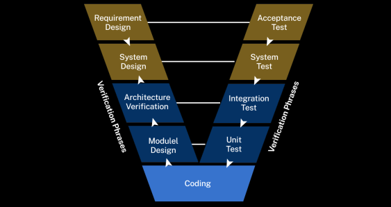

# SPM Notes

# End Sem

# Unit 5: Software Implementation and Deployment

## Lecture 32: Introduction to Software Implementation

### **1. Programming Language and Development Environment**  
- **Overview**: The choice of programming language and development environment impacts the efficiency, scalability, and success of the software project.  
- **Programming Language**:  
  - Selected based on performance needs, platform compatibility, and project type (e.g., Python for AI/ML, Java for enterprise solutions, C++ for system-level programming).  
  - Factors to consider: team expertise, community support, and integration with libraries or frameworks.  
- **Development Environment**:  
  - IDEs like IntelliJ, Eclipse, VS Code, and PyCharm provide features like syntax highlighting, debugging tools, and version control integration (e.g., Git).  
  - The environment should support plugins, automation, and efficient collaboration.

---

### **2. Coding Practices and Standards**  
- **Overview**: Consistent practices and standards improve code quality, readability, and maintainability.  
- **Best Practices**:  
  - Write modular, reusable, and well-structured code.  
  - Follow principles like DRY (Don’t Repeat Yourself) and KISS (Keep It Simple, Stupid).  
  - Implement error handling and exception management to prevent runtime crashes.  
  - Use descriptive and meaningful names for variables, classes, and methods (e.g., `calculateTax()` instead of `calc()`).
- **Coding Standards**:  
  - Adhere to industry-recognized standards (e.g., PEP 8 for Python, Google Style Guide for C++).  
  - Maintain proper indentation and code formatting for consistency.  
  - Conduct regular peer reviews to ensure adherence to standards and improve quality.

---

### **3. Code Optimization and Documentation**  
- **Overview**: Code optimization ensures better performance, while documentation facilitates understanding and maintenance.  
- **Code Optimization**:  
  - Use efficient algorithms and data structures (e.g., hash tables for quick lookups).  
  - Remove redundant code and minimize resource usage.  
  - Optimize database queries and reduce API call overhead.  
  - Tools like profilers and benchmarks can help identify bottlenecks.  
- **Documentation**:  
  - Add in-line comments for clarity on complex logic.  
  - Prepare external documents like API references, module overviews, and architecture diagrams.  
  - Provide user manuals for end-users and technical documentation for developers.

---

### **4. Testing and Debugging**  
- **Overview**: Essential for ensuring software reliability, functionality, and defect-free deployment.  
- **Testing**:  
  - Includes:  
    - **Unit Testing**: Validates individual components for correctness.  
    - **Integration Testing**: Ensures modules interact properly.  
    - **System Testing**: Verifies the software as a whole against requirements.  
  - Tools: JUnit (Java), PyTest (Python), Selenium (UI testing).  
  - Focus on both functional and non-functional requirements during testing.  
- **Debugging**:  
  - Debugging tools in IDEs (e.g., IntelliJ, VS Code) provide breakpoints, stack traces, and step-by-step execution.  
  - Analyze error logs and use systematic troubleshooting to isolate and fix defects.  
  - Common approaches include hypothesis-driven debugging and binary search for pinpointing errors.

---
---

## Lecture 33: Software Configuration Management (SCM)

### **1. Version Control System (VCS)**  
  - A Version Control System (VCS) is a tool that tracks and manages changes to files (e.g., source code, documentation) over time.  
  - It enables collaboration among developers, maintains version history, and allows rollback to previous versions if needed.  
  - VCS ensures consistency and traceability, especially in large or distributed teams.

#### **Types of VCS**  
1. **Centralized VCS (CVCS)**:  
   - All project files and history are stored in a single central repository. Developers check out files, make changes, and commit them back.  
   - **Examples**: SVN (Apache Subversion), Perforce.  
   - **Advantages**:  
     - Simple to set up and understand.  
     - Centralized control provides clear oversight.  
   - **Disadvantages**:  
     - A single point of failure—if the central server goes down, all work halts.  
     - Limited offline capabilities.  

2. **Distributed VCS (DVCS)**:  
   - Every developer has a complete copy of the repository, including its full history, enabling work even without a network connection.  
   - **Examples**: Git, Mercurial.  
   - **Advantages**:  
     - Enables offline work and faster operations for local tasks.  
     - Better support for branching and merging.  
   - **Disadvantages**:  
     - More complex to learn and manage.  

---

### **2. Techniques for Managing Source Code**  
- Effective source code management ensures smooth collaboration, prevents conflicts, and maintains code quality.

#### **Branching**  
- Branching allows developers to create independent versions of the codebase for specific tasks.  
- **Common Branch Types**:  
  1. **Feature Branch**: Used for developing a specific feature.  
  2. **Hotfix Branch**: Created for urgent bug fixes in the production environment.  
  3. **Release Branch**: Stabilized branch for preparing code for deployment.  
  4. **Main Branch (Master/Trunk)**: The stable version of the code ready for production.

#### **Merging**  
- Combines changes from different branches into one.  
- **Merge Strategies**:  
  1. **Fast-Forward Merge**: Adds changes directly if no other commits exist.  
  2. **Recursive Merge**: Creates a new merge commit when multiple changes are made in different branches.  
  3. **Rebase**: Reapplies changes from one branch onto another, creating a cleaner commit history.

#### **Commit Practices**  
- Commit frequently with clear, meaningful messages.  
- Keep commits small and focused to simplify troubleshooting and rollback.  
- Avoid committing large, unrelated changes in a single commit.

---

### **3. SCM Tools and Technologies**  

SCM tools automate and simplify version control, collaboration, and change management. These tools are integral to modern software development workflows.  

#### **Popular SCM Tools**  
1. **Git**:  
   - Widely used distributed VCS with robust branching, merging, and version tracking capabilities.  
   - Often paired with platforms like GitHub, GitLab, or Bitbucket for enhanced collaboration.  

2. **SVN (Apache Subversion)**:  
   - Centralized VCS suitable for simpler workflows and projects.  
   - Provides good support for binary files and large repositories.  

3. **Bitbucket**:  
   - A Git-based platform integrated with Atlassian products (e.g., Jira).  
   - Offers repository hosting and collaboration tools.  

4. **GitHub**:  
   - Popular Git repository hosting platform.  
   - Provides features like pull requests, issue tracking, and integrated CI/CD.  

5. **GitLab**:  
   - Git-based platform offering repository hosting, CI/CD pipelines, and project management tools.  
   - Strong focus on DevOps integration.

#### **Key Features of SCM Tools**  
- **Version Tracking**: Tracks every change made to the codebase with detailed logs.  
- **Branching and Merging**: Simplifies parallel development and collaboration.  
- **Collaboration Tools**: Supports pull requests, code reviews, and discussions.  
- **Integration**: Compatible with CI/CD pipelines and project management tools (e.g., Trello, Jira).  
- **Backup and Recovery**: Ensures code integrity and prevents data loss.  

### **4. Benefits of Software Configuration Management**  
1. **Collaboration**: Enables multiple developers to work on the same project without conflicts.  
2. **Versioning**: Keeps track of all changes, allowing rollback to previous versions when necessary.  
3. **Traceability**: Provides a clear history of what changes were made, by whom, and why.  
4. **Code Quality**: Encourages clean, modular code through reviews and testing before merging.  
5. **Risk Mitigation**: Prevents loss of work through backups and reduces deployment risks by ensuring code consistency.

---
---

<!-- ======================================================================================= -->

## Lecture 34: Introduction to Software integration and deployment

### 1. **Introduction to Software Integration and Deployment**

**Software Integration** involves combining individual software modules into a unified system. It ensures that various components of the software work together as expected. **Software Deployment** refers to the process of delivering a completed software product to the users or making it available for use. The integration and deployment process is crucial for the smooth functioning of software systems.

---

### 2. **Integration Strategies and Techniques**

- **Top-Down Integration**: Starts with the main module (top) and gradually adds lower-level modules. Used when the overall architecture is clear.
- **Bottom-Up Integration**: Begins with lower-level modules and progressively integrates higher-level modules.
- **Big Bang Integration**: All modules are integrated at once, often causing issues due to lack of early testing.
- **Incremental Integration**: Modules are integrated step-by-step, allowing for early testing of each integration.

**Techniques**:
- **Interface Mocking**: Simulates external components to integrate and test modules in isolation.
- **Stub and Driver**: **Stubs** simulate missing lower-level modules, and **drivers** simulate higher-level modules for testing.

---

### 3. **Integration Testing**

- **Definition**: Testing of integrated components/modules to ensure they work together as expected.
- **Types**:
  - **Component Integration Testing**: Testing interactions between individual components/modules.
  - **System Integration Testing**: Testing how the entire system of components works together.
- **Methods**:
  - **Black-box testing**: Focuses on inputs and outputs, ignoring the internal code.
  - **White-box testing**: Tests internal structures and logic of integrated modules.
  
**Key Focus**:
- Verify that communication between integrated modules works as expected.
- Detect interface mismatches, data flow issues, and resource conflicts.

---

### 4. **Continuous Integration (CI)**

- **Definition**: A development practice where developers integrate code into a shared repository frequently, ideally multiple times a day.
- **Goals**: 
  - Minimize integration problems.
  - Ensure codebase is always in a deployable state.
- **Tools**: Jenkins, Travis CI, CircleCI, GitLab CI.
- **CI Process**:
  1. Developers commit changes to the version control system.
  2. CI server automatically builds the code and runs tests.
  3. If any issues are found, developers are alerted to fix them.

**Benefits**:
- Early detection of integration issues.
- Faster development cycles and quicker bug fixes.
- Improved collaboration among team members.

---

### 5. **Deployment Environment and Automation**

**Deployment Environment**:
- The environment in which the software will run, including hardware, operating systems, network configurations, and other software dependencies.
- Key types:
  - **Development Environment**: Used for coding and unit testing.
  - **Staging Environment**: Mirrors the production environment for final testing before deployment.
  - **Production Environment**: The live environment where the end users interact with the system.

**Deployment Automation**:
- **Definition**: Automating the process of deploying software to different environments.
- **Tools**: Jenkins, Ansible, Chef, Puppet, Kubernetes, Docker.
- **Process**:
  1. **Build Automation**: Compile and package the application into a deployable format.
  2. **Deployment Pipeline**: Automated process that moves code through various stages (build, test, deploy).
  3. **Rollback Mechanism**: If an issue arises, automation ensures previous stable versions are deployed.

**Benefits of Automation**:
- Faster, reliable, and repeatable deployments.
- Reduced manual errors.
- Easier scaling and consistency across environments.

--- 
---

## Lecture 35: System testing

### 1. **System Testing Process and Types**

**System Testing** is the process of testing the entire system as a whole to ensure it meets the specified requirements. It involves verifying both functional and non-functional aspects of the system, including performance, security, and usability.

**System Testing Process**:
1. **Requirement Analysis**: Understand the system’s functional and non-functional requirements to prepare test scenarios.
2. **Test Planning**: Create a test plan that includes scope, resources, timelines, and testing criteria.
3. **Test Case Design**: Develop test cases based on the requirements.
4. **Test Execution**: Execute test cases and report defects.
5. **Defect Management**: Track, analyze, and resolve defects found during testing.
6. **Test Closure**: After successful testing, ensure all defects are fixed, and testing is complete.

**Types of System Testing**:
- **Functional Testing**: Verifies if the system performs as expected based on functional requirements.
- **Non-Functional Testing**:
  - **Performance Testing**: Tests the speed, scalability, and reliability of the system under various conditions.
  - **Security Testing**: Ensures that the system is protected against unauthorized access, vulnerabilities, and threats.
  - **Usability Testing**: Focuses on user-friendliness, user interface, and overall experience.
  - **Compatibility Testing**: Verifies if the system works across different environments, browsers, or devices.
- **Regression Testing**: Ensures that new changes do not negatively affect existing functionality.
- **Acceptance Testing**: Verifies if the system meets business requirements and is ready for production.

---

### 2. **Test Design Techniques**

**Test Design Techniques** are methods used to create effective test cases that ensure maximum test coverage and identify defects early in the system.

**Common Test Design Techniques**:
1. **Black-box Testing**:
   - Focuses on the inputs and outputs without considering internal logic.
   - Common techniques: Equivalence Partitioning, Boundary Value Analysis, Decision Table Testing, State Transition Testing.
   
2. **White-box Testing**:
   - Focuses on the internal logic, code, and structure of the system.
   - Common techniques: Code coverage, Path testing, Condition Coverage, Loop Testing.
   
3. **Gray-box Testing**:
   - Combines both black-box and white-box testing techniques.
   - Useful when testers have partial knowledge of the internal system.
   
4. **Exploratory Testing**:
   - Testers actively explore the system based on their understanding, rather than following predefined test cases.
   
5. **Ad-hoc Testing**:
   - Unstructured testing with no formal planning or test case design. It is usually done to explore untested areas.

---

### 3. **System Testing Best Practices and Case Studies**

**System Testing Best Practices**:
1. **Test Early and Often**: Begin testing early in the development process and continuously throughout the lifecycle.
2. **Automate Repetitive Tests**: Use automation for regression and performance tests to save time and improve accuracy.
3. **Clear Documentation**: Document test cases, results, and defects clearly to track testing progress and ensure thorough testing.
4. **Test Different Environments**: Ensure testing is done in a variety of environments (e.g., different OS, browsers, devices) to verify compatibility.
5. **Collaboration Between Teams**: Ensure strong communication between developers, testers, and business analysts to understand requirements better and ensure accurate test cases.
6. **Risk-based Testing**: Prioritize testing based on the likelihood and impact of potential defects.
7. **Load Testing**: Regularly test the system under varying loads to assess performance under stress.
8. **Defect Tracking**: Use defect tracking tools to monitor and resolve issues efficiently.

**Case Studies**:
- **Example 1: E-Commerce Platform Testing**
  - **Problem**: An e-commerce platform with multiple payment integrations and user authentication systems.
  - **Solution**: 
    - Functional testing to verify that each payment option works as expected.
    - Performance testing to ensure the system can handle high traffic during sales events.
    - Security testing to prevent data breaches during transactions.
    - Usability testing to ensure the checkout process is smooth and user-friendly.
  - **Result**: The system met all requirements, but issues with performance under load were identified and resolved before launch.

- **Example 2: Banking Application Testing**
  - **Problem**: A banking application needing to integrate with various back-end systems securely and efficiently.
  - **Solution**:
    - Black-box testing for functional scenarios like balance inquiries, fund transfers, etc.
    - Security testing to ensure encryption and secure access controls.
    - Compatibility testing to ensure the application works across different devices and platforms.
  - **Result**: The application was successfully deployed after fixing minor compatibility issues and enhancing security features.

---
---

## Lecture 36: System Testing and Documentation

### 1. **Objectives of Documentation**

Documentation in system testing serves several important purposes:
- **Clarity**: Ensures that all aspects of the testing process are well-defined and understood.
- **Traceability**: Provides a clear record of requirements, test cases, and results, allowing for easy tracking of the testing process and any issues encountered.
- **Communication**: Facilitates communication among developers, testers, and stakeholders by providing detailed records of the testing efforts.
- **Accountability**: Keeps track of who conducted the testing, when it was done, and what the outcomes were.
- **Compliance**: Helps meet industry standards and regulatory requirements, ensuring the software is reliable and safe for release.

---

### 2. **Test Plan, Case, Procedure, and Result Documentation**

**Test Plan Documentation**:
- **Purpose**: Defines the scope, strategy, objectives, resources, and schedule of testing.
- **Contents**:
  - **Introduction**: Purpose of testing and the system to be tested.
  - **Scope**: Defines what will and will not be tested.
  - **Objectives**: What the testing aims to achieve.
  - **Resources**: Personnel, tools, hardware, and software required for testing.
  - **Test Strategy**: The approach (manual or automated) and types of tests (unit, integration, system, etc.).
  - **Schedule**: Timeframe for each testing phase.
  - **Risk and Contingency**: Potential risks and backup plans for issues that may arise.

**Test Case Documentation**:
- **Purpose**: Defines individual test cases based on the requirements and system features.
- **Contents**:
  - **Test Case ID**: Unique identifier for each test case.
  - **Test Description**: A brief overview of the test.
  - **Preconditions**: What needs to be set up before running the test.
  - **Test Steps**: Detailed steps to execute the test.
  - **Expected Results**: What should happen when the test is executed correctly.
  - **Actual Results**: The outcomes of running the test.
  - **Pass/Fail Status**: Whether the test passed or failed.
  - **Remarks**: Any additional notes, such as issues encountered or deviations.

**Test Procedure Documentation**:
- **Purpose**: Details the systematic steps involved in performing the tests.
- **Contents**:
  - **Step-by-step Instructions**: Specific actions testers should follow to execute the tests.
  - **Expected Outcomes**: Expected results at each step.
  - **Resources Required**: Hardware, software, and tools needed for the test.
  - **Environment Setup**: How the test environment should be configured.

**Test Result Documentation**:
- **Purpose**: Documents the outcomes of the executed tests.
- **Contents**:
  - **Test Execution Summary**: An overview of which tests were executed.
  - **Defects Found**: Any issues or bugs discovered during testing, along with severity.
  - **Test Status**: Whether the test passed, failed, or was blocked.
  - **Remarks**: Observations about the test run, such as external factors influencing the test.

---

### 3. **Documentation of Best Practice and Case Study**

**Best Practices for Test Documentation**:
1. **Consistency**: Maintain consistent formats across all documents to ensure clarity and ease of understanding.
2. **Clear Naming Conventions**: Use meaningful names for test cases and documents to make them easily identifiable.
3. **Automation**: Use automated tools where possible to streamline the documentation process (e.g., test case management tools like TestRail).
4. **Traceability**: Link test cases to specific requirements or user stories to ensure all aspects are tested.
5. **Version Control**: Use versioning to track changes in test documentation and ensure everyone is working with the latest version.
6. **Detailed Reporting**: Always provide enough detail to enable others to reproduce and understand test execution results.
7. **Collaboration**: Ensure documentation is accessible and shareable among team members for collaboration and feedback.

**Case Study Example: E-Commerce System Testing Documentation**

- **Objective**: Test an e-commerce platform that includes user registration, product browsing, cart management, and payment processing.
  
  **Test Plan**:
  - Scope: Testing all user-facing features including product search, checkout, and payment.
  - Resources: Testers, dev team support, testing tools (e.g., Selenium, JIRA).
  - Schedule: 3-week timeline with weekly check-ins for progress review.
  
  **Test Cases**:
  - Test Case 1: Register new user account.
    - Preconditions: User has valid email address.
    - Steps: Enter email, password, and user details; submit form.
    - Expected Result: User account should be created, and a welcome email is sent.
    - Actual Result: (To be filled post-execution).
    - Pass/Fail Status: Pending.

  **Test Procedure**:
  - Set up the testing environment using the latest version of the platform.
  - Execute registration tests and log any failures.
  - After testing user registration, move to cart and payment testing.

  **Test Result**:
  - Summary: 10 test cases executed, 8 passed, 2 failed.
  - Defects Found: 
    - Bug #101: Registration form crashes if special characters are used in the email field.
    - Bug #102: Payment gateway shows an error on valid credit cards.
  - Pass/Fail: 80% of tests passed, defects under investigation.

---
---

## Lecture 37: Deployment Strategies

### 1. **Traditional Deployment Approaches**

**Traditional Deployment** involves manually releasing software to production in discrete stages, typically through a series of steps involving development, testing, staging, and production environments. This method is often less automated and may involve downtime during the release process.

**Key Steps in Traditional Deployment**:
1. **Development Phase**: Code is written and unit tested by developers.
2. **Testing Phase**: The code is deployed to a testing environment where it undergoes various forms of testing (e.g., system, integration, and user acceptance).
3. **Staging Phase**: After testing, the software is deployed to a staging environment that closely resembles production.
4. **Production Phase**: Finally, the software is deployed to the live production environment, often involving downtime for system updates.

**Drawbacks**:
- **Downtime**: Traditional deployment often involves some downtime, especially when deploying updates or patches.
- **Manual Process**: The process can be time-consuming and prone to human error.
- **Longer Feedback Loops**: Bugs and issues are typically discovered after deployment, which leads to slower fixes.

---

### 2. **A/B Testing Deployment**

**A/B Testing Deployment** is a strategy where two different versions of a software feature (Version A and Version B) are deployed to different user groups in parallel to compare their performance. This allows teams to determine which version performs better in terms of user engagement, conversion rates, or other metrics.

**Steps in A/B Testing**:
1. **Versioning**: Create two different versions of the feature or product, ensuring that only the specific feature being tested differs between the versions.
2. **Random Allocation**: Split users into two groups, where one group sees Version A and the other sees Version B.
3. **Collect Data**: Measure key metrics (e.g., performance, user behavior, clicks) for both versions.
4. **Analysis**: Compare the results to determine which version delivers the better user experience or desired outcome.
5. **Decision**: Based on the results, either implement the better-performing version to all users or iterate on the designs.

**Advantages**:
- **Data-Driven Decisions**: Provides empirical evidence on which version works better, reducing guesswork.
- **Reduced Risk**: Changes are tested on a small portion of users, minimizing the risk of wide-scale negative impact.
  
**Example**: A website might test two different layouts of its homepage (A vs. B) to see which one results in higher click-through rates or sales.

---

### 3. **Continuous Integration and Deployment (CI/CD)**

**Continuous Integration (CI)** and **Continuous Deployment (CD)** are modern software deployment practices that emphasize automation and frequent, incremental releases.

- **Continuous Integration (CI)**:
  - The practice of merging code changes into a shared repository frequently, usually multiple times a day.
  - Automated tests are run to ensure the new code doesn’t break existing functionality.
  - **Benefits**: 
    - Early detection of issues.
    - Faster feedback for developers.
    - Higher software quality.
  - **Example**: Developers commit code to GitHub, which triggers an automated build and test process using tools like Jenkins, Travis CI, or GitLab CI.

- **Continuous Deployment (CD)**:
  - Extends CI by automating the entire deployment process, allowing new code to be automatically pushed to production after passing automated tests.
  - The process includes building, testing, and deploying the software with minimal manual intervention.
  - **Benefits**: 
    - Faster time-to-market.
    - Reduced manual effort in deployments.
    - Frequent updates and bug fixes.
  - **Example**: After successful testing in CI, new code is automatically deployed to production servers using tools like Docker, Kubernetes, or AWS CodeDeploy.

**CI/CD Pipeline Steps**:
1. **Code Commit**: Developers commit changes to the version control system.
2. **Build**: The code is compiled, and dependencies are resolved.
3. **Test**: Automated tests are executed to ensure functionality.
4. **Deploy**: After passing tests, the code is deployed to production or staging environments.
5. **Monitor**: Post-deployment monitoring ensures the software is performing as expected.

**Advantages of CI/CD**:
- **Speed**: Continuous delivery of small changes improves time-to-market.
- **Automation**: Reduces human intervention, lowering the risk of errors during deployment.
- **Quality Assurance**: Automated tests ensure that changes don't break existing functionality.
- **Scalability**: CI/CD enables easy scaling for larger applications due to its automated nature.

---

### Summary of Key Deployment Strategies:

| **Deployment Strategy**    | **Description**                                                                 | **Advantages**                           |
|----------------------------|---------------------------------------------------------------------------------|------------------------------------------|
| **Traditional Deployment** | Manual, staged process from development to production.                          | Simplicity, control over deployment.    |
| **A/B Testing Deployment** | Deploys different versions to separate user groups for comparison.             | Data-driven decisions, minimizes risk.  |
| **CI/CD**                  | Automated integration, testing, and deployment processes.                      | Faster feedback, reduced errors, frequent updates. |

---
---

## Lecture 38: Manual and Scripted Deployment

### 1. **Deployment Method and Process**

**Manual Deployment**:
- **Definition**: The process where software is deployed to production or other environments manually by system administrators or developers. This involves copying files, configuring systems, and starting services manually.
  
**Manual Deployment Process**:
1. **Preparation**: Set up the environment by ensuring necessary hardware, software, and configurations are ready.
2. **Build Deployment Package**: Prepare the final version of the software, including binaries, scripts, and configurations.
3. **Deploy to Environment**: Manually move the deployment package to the target environment (e.g., copying files, configuring settings).
4. **Testing**: Test the deployed application for proper functionality and performance.
5. **Monitoring**: Monitor the application after deployment to ensure it runs smoothly and to catch any potential issues.

**Scripted Deployment**:
- **Definition**: Uses scripts (e.g., shell scripts, PowerShell scripts, or automation tools) to automate the deployment process. This method reduces manual effort and human error.

**Scripted Deployment Process**:
1. **Write Deployment Script**: Write scripts that automate tasks like copying files, setting configurations, and restarting services.
2. **Version Control**: Store deployment scripts in version control systems (e.g., Git).
3. **Automation Execution**: Run scripts to automatically deploy the software to the required environments.
4. **Testing**: Automated testing is often integrated into the deployment process to verify the deployment.
5. **Monitoring**: Automated tools monitor deployment status and system health during and after the deployment.

---

### 2. **Deployment Tools and Technologies**

**Manual Deployment Tools**:
- **SSH (Secure Shell)**: Allows remote access to servers for manual intervention, file transfer, and service management.
- **FTP/SFTP**: File transfer protocols that are often used to move files from local machines to remote servers.

**Scripted Deployment Tools**:
- **Ansible**: An open-source automation tool for IT tasks, including software deployment. It uses YAML to define automation tasks.
- **Chef**: An automation platform that manages infrastructure and applications using Ruby-based scripts.
- **Puppet**: An automation tool that automates the deployment of software and infrastructure configuration.
- **Jenkins**: An automation server that facilitates continuous integration and continuous deployment, integrating with tools like Ansible and Docker.
- **Docker**: Containerization technology that allows packaging software and its dependencies into containers, making deployments more consistent and portable.
- **Kubernetes**: An orchestration tool for automating deployment, scaling, and management of containerized applications, often used in combination with Docker.

**Technologies Supporting Deployment**:
- **Cloud Platforms**: AWS, Microsoft Azure, and Google Cloud provide automated deployment options through services like AWS CodeDeploy and Azure DevOps.
- **CI/CD Pipelines**: Tools like Jenkins, GitLab CI, and Travis CI integrate with deployment scripts and manage the deployment lifecycle automatically.
- **Containerization**: Docker and Kubernetes enable consistent deployment across various environments by using containers.

---

### 3. **Benefits and Challenges**

**Benefits of Manual Deployment**:
- **Control**: Provides full control over every step of the deployment process.
- **Flexibility**: Can be tailored for unique or one-time deployment requirements.
- **Simple for Small Projects**: Effective for small projects or environments with infrequent updates.

**Challenges of Manual Deployment**:
- **Time-Consuming**: Requires significant time and effort, especially for large systems.
- **Prone to Human Error**: Manual intervention increases the risk of mistakes.
- **Scalability Issues**: Hard to scale with increased deployment frequency or complexity.
- **No Rollback**: Difficult to undo deployments if something goes wrong unless manual intervention is planned.

**Benefits of Scripted Deployment**:
- **Efficiency**: Speeds up the deployment process, reducing the time spent on repetitive tasks.
- **Consistency**: Automated deployment ensures that the same steps are followed every time, reducing the chance of errors.
- **Reproducibility**: The same deployment script can be used across multiple environments, ensuring consistency.
- **Scalability**: Can handle complex, large-scale deployments and be integrated with CI/CD pipelines.
  
**Challenges of Scripted Deployment**:
- **Initial Setup Complexity**: Writing scripts and setting up automation can be time-consuming upfront.
- **Maintenance**: Scripts need to be maintained and updated, especially when environments or dependencies change.
- **Learning Curve**: Requires knowledge of scripting languages and deployment tools.
- **Debugging**: Debugging automated deployment failures can be complex and requires detailed log tracking.

---

### 4. **Emerging Trends in Deployment**

1. **Infrastructure as Code (IaC)**:
   - The practice of managing and provisioning computing infrastructure using machine-readable definition files (e.g., Terraform, AWS CloudFormation).
   - It allows environments to be easily replicated and managed automatically.
   - **Example**: Instead of manually setting up servers, infrastructure can be defined and deployed automatically using code.

2. **Containerization and Microservices**:
   - With the rise of Docker and Kubernetes, containerized applications have become the norm for modern deployment strategies.
   - **Microservices** allow different components of a system to be deployed independently, leading to faster updates and scaling.
   - **Example**: An e-commerce platform may deploy separate containers for the product catalog, payment processing, and user authentication.

3. **Serverless Deployment**:
   - In a serverless architecture, developers write code that runs in response to events or triggers without worrying about the underlying infrastructure.
   - Cloud providers like AWS Lambda and Google Cloud Functions offer serverless deployment models.
   - **Example**: Deploying a simple function to process image uploads or handle webhooks without managing servers.

4. **Blue-Green and Canary Deployments**:
   - **Blue-Green Deployment**: Two identical environments (blue and green) are maintained. One is active, and the other is idle. The new version is deployed to the idle environment (green), and once it’s tested, the traffic is switched over.
   - **Canary Deployment**: The new version is released to a small subset of users (canary) before gradually rolling it out to the full user base, reducing risk.

5. **Continuous Deployment**:
   - A trend towards automating the entire deployment pipeline, where every code change that passes automated tests is deployed directly to production without manual intervention.
   - This reduces the time between writing code and delivering new features to users.

---

### Summary of Key Points:

| **Deployment Method**      | **Description**                                         | **Benefits**                            | **Challenges**                         |
|----------------------------|---------------------------------------------------------|-----------------------------------------|----------------------------------------|
| **Manual Deployment**      | Manual steps to deploy software to production.          | Full control, flexibility, simplicity.  | Time-consuming, prone to errors, hard to scale. |
| **Scripted Deployment**    | Automates deployment through scripts or automation tools. | Efficiency, consistency, scalability.   | Initial complexity, maintenance, learning curve. |
| **Emerging Trends**         | New technologies like IaC, containers, serverless, and CI/CD pipelines. | Faster deployment, reduced risk, scalability. | Requires specialized knowledge and infrastructure. |

---
---

## Lecture 39: Deployment Monitoring and Troubleshooting

### 1. **Deployment Monitoring Techniques**

**Definition**: Deployment monitoring involves tracking the health, performance, and behavior of applications and infrastructure after deployment. It helps identify issues early and ensures that the deployed software functions as expected.

**Techniques**:
- **Real-Time Monitoring**: Continuously monitor the application and infrastructure to ensure they are functioning properly in real time. Tools like **Prometheus**, **Datadog**, and **New Relic** help collect data and present it on dashboards for instant insights.
  
- **Automated Alerts**: Set up alerts based on predefined thresholds for application performance, error rates, or system health. Alerts can be triggered for issues like high CPU usage, memory leaks, or service crashes.
  
- **Health Checks**: Perform regular health checks on services and APIs. These can include uptime checks (Ping tests) or application-specific checks (e.g., verifying database connectivity). Tools like **Nagios** or **Healthchecks.io** are commonly used.

- **Synthetic Monitoring**: Simulate user transactions and interactions with the deployed system to assess performance from the user’s perspective. Tools like **Uptrends** or **Pingdom** are used for synthetic monitoring.

- **User Monitoring**: Monitor user interactions and satisfaction using **Google Analytics** or **Hotjar** to identify any slowdowns or issues experienced by users.

---

### 2. **Log Analysis and Troubleshooting**

**Definition**: Log analysis is the process of reviewing and interpreting logs generated by applications, servers, or services to identify and troubleshoot issues.

**Log Analysis**:
- **Centralized Logging**: Use tools like **ELK Stack (Elasticsearch, Logstash, Kibana)**, **Splunk**, or **Graylog** to aggregate logs from different servers and services into one central location for easier access and analysis.
  
- **Log Levels**: Logs are classified into different levels:
  - **ERROR**: Indicates severe issues that require immediate attention.
  - **WARN**: Indicates potential problems but not critical.
  - **INFO**: General information about the application's operation.
  - **DEBUG**: Detailed information for developers to debug the application.

- **Log Patterns**: Analyze logs for specific error patterns, exceptions, or failed operations. Look for stack traces, failed database queries, or network timeouts to trace the root cause of issues.

**Troubleshooting**:
- **Reproduce the Issue**: Identify and replicate the problem in a controlled environment (dev or staging) to observe its behavior and trace it.
  
- **Trace Requests**: Track user requests or transactions through different layers of the system to understand where the failure occurred. Tools like **Jaeger** or **Zipkin** provide distributed tracing for complex applications.

- **System Resource Monitoring**: Analyze system resource utilization (CPU, memory, disk) using tools like **top**, **htop**, or **Prometheus** to determine if performance issues are due to resource bottlenecks.

- **Error Repositories**: Maintain an error repository where common issues and their solutions are documented for quick reference and resolution.

---

### 3. **Performance Optimization and Tuning**

**Definition**: Performance optimization and tuning involve improving the efficiency and speed of applications, reducing response times, and enhancing system resources' usage.

**Techniques**:
- **Database Optimization**: Optimize database queries, use indexing, and improve schema design to speed up database interactions. Use tools like **Query Profiler** or **Explain Plans** to identify slow queries.
  
- **Caching**: Implement caching mechanisms at multiple layers (e.g., client-side, application-level, and database-level) to reduce latency and improve performance. Use caching tools like **Redis** or **Memcached** to store frequently accessed data.

- **Load Balancing**: Distribute incoming traffic across multiple servers to balance the load, prevent server overload, and improve response times. Use **NGINX**, **HAProxy**, or **AWS Elastic Load Balancing**.

- **Code Optimization**: Optimize application code to ensure it runs efficiently, reducing unnecessary processing or memory usage. Profiling tools like **Py-Spy** (for Python) or **JProfiler** (for Java) can be used to identify performance bottlenecks.

- **Compression**: Use data compression techniques (e.g., **gzip**, **brotli**) to reduce the size of transferred data and improve response times.

- **Horizontal Scaling**: Scale the application horizontally by adding more machines or instances, rather than just increasing the power of a single machine (vertical scaling).

- **Asynchronous Processing**: Use asynchronous operations (e.g., **message queues**, **background jobs**) to offload heavy tasks and prevent them from blocking the main application flow.

---

### 4. **Security and Infrastructure Monitoring**

**Definition**: Security and infrastructure monitoring focus on ensuring that the deployed software and its underlying infrastructure are secure, reliable, and free from threats or vulnerabilities.

**Security Monitoring**:
- **Intrusion Detection Systems (IDS)**: Monitor network traffic for unusual or malicious activity using IDS tools like **Snort** or **Suricata**.
  
- **Vulnerability Scanning**: Use tools like **OWASP ZAP**, **Nessus**, or **Qualys** to scan the application and infrastructure for vulnerabilities and patch them promptly.

- **Access Control and Authentication**: Monitor user access and authentication logs to detect unauthorized access attempts. Use **Multi-Factor Authentication (MFA)** to enhance security.
  
- **Threat Intelligence**: Gather information about potential security threats and attack patterns from external sources. Integrate threat feeds into monitoring systems to identify emerging risks.

**Infrastructure Monitoring**:
- **Server Health Monitoring**: Keep track of the health of servers and their resources (CPU, memory, disk space). Tools like **Nagios**, **Zabbix**, or **Datadog** are commonly used for server monitoring.
  
- **Network Monitoring**: Monitor network traffic to ensure that there are no bottlenecks, disruptions, or unauthorized traffic. Tools like **Wireshark**, **SolarWinds**, or **PRTG** are used for network monitoring.

- **Availability Monitoring**: Monitor the uptime of services and applications using tools like **Pingdom** or **Uptime Robot** to ensure the infrastructure is highly available and reliable.

- **Backup and Recovery**: Regularly monitor and test backup systems to ensure that data can be recovered in case of a failure. Use **AWS Backup**, **Veeam**, or similar tools for managing backups.

---

### Summary of Key Points:

| **Topic**                           | **Description**                                                                                  | **Tools and Techniques**                              |
|-------------------------------------|--------------------------------------------------------------------------------------------------|------------------------------------------------------|
| **Deployment Monitoring**           | Continuously track the health, performance, and functionality of deployed software.               | Prometheus, New Relic, Datadog, Nagios, Pingdom      |
| **Log Analysis and Troubleshooting**| Review logs to identify issues and trace the root cause of problems.                             | ELK Stack, Splunk, Graylog, Jaeger, Zipkin           |
| **Performance Optimization**        | Improve the efficiency and speed of the application and infrastructure.                          | Redis, Memcached, NGINX, HAProxy, Query Profiler     |
| **Security and Infrastructure Monitoring** | Monitor and secure infrastructure and applications from potential threats or vulnerabilities. | Snort, OWASP ZAP, Nessus, Datadog, SolarWinds        |

---
---

## Lecture 40: Software Maintenance and Support

### 1. **Troubleshooting and Debugging**

**Definition**: Troubleshooting and debugging are processes used to identify, diagnose, and resolve issues within a software system, ensuring that it functions correctly after deployment.

**Techniques**:
- **Reproduce the Issue**: The first step in troubleshooting is to reproduce the issue in a controlled environment (e.g., development or staging) to observe and analyze its behavior.
  
- **Use Debugging Tools**: Tools like **GDB** (for C/C++), **PDB** (for Python), and **JDB** (for Java) can be used to step through code, inspect variables, and analyze the program flow to identify bugs.

- **Logs and Monitoring**: Check application logs, system logs, and monitoring tools (e.g., **New Relic**, **Datadog**) to identify patterns or specific errors that might indicate the root cause of the issue.

- **Unit Testing**: Run unit tests on individual code components to identify defects in specific sections of the software. Frameworks like **JUnit** (Java), **PyTest** (Python), or **JUnit** (C++) are commonly used.

- **Error Reporting**: Use error tracking systems like **Sentry** or **Rollbar** to capture runtime exceptions and errors that occur in production environments.

---

### 2. **Maintenance Activities and Processes**

**Definition**: Software maintenance involves modifying and updating software after its release to correct faults, improve performance, or adapt to a changing environment.

**Types of Maintenance**:
- **Corrective Maintenance**: Fixing defects or bugs that appear after the software has been deployed.
  
- **Adaptive Maintenance**: Updating the software to ensure compatibility with changing environments (e.g., new OS versions, hardware changes).
  
- **Perfective Maintenance**: Enhancing or adding features to improve the software's performance, usability, or functionality.
  
- **Preventive Maintenance**: Making proactive changes to improve code quality and reduce future defects, such as refactoring the code to improve maintainability.

**Processes**:
- **Issue Tracking**: Use issue tracking systems like **JIRA** or **Trello** to manage and prioritize bug fixes, enhancements, and other maintenance tasks.
  
- **Change Management**: Implement change management processes to ensure all modifications are reviewed, tested, and documented to prevent introducing new issues.

- **Regression Testing**: Regularly conduct regression testing to ensure that new changes do not break existing functionality. This can be automated using frameworks like **Selenium** or **JUnit**.

- **Performance Tuning**: Monitor software performance post-deployment and optimize it by addressing bottlenecks, inefficient code, or database queries.

---

### 3. **Configuration Management and Version Control**

**Definition**: Configuration management and version control are processes used to manage the software's code, configurations, and environments throughout the development and maintenance phases.

**Configuration Management**:
- **Purpose**: Ensures that all software components, configurations, and environments are correctly documented and maintained across all stages of development and deployment.
  
- **Tools**:
  - **Ansible**: Automates configuration management and deployment.
  - **Chef**: Manages infrastructure and configurations.
  - **Puppet**: Automates server management and configuration.

**Version Control**:
- **Purpose**: Keeps track of all changes made to the source code over time, allowing developers to collaborate and maintain multiple versions of the software.
  
- **Tools**:
  - **Git**: A distributed version control system used to track changes in code. **GitHub**, **GitLab**, and **Bitbucket** are popular platforms for collaboration and remote version control.
  - **SVN**: A centralized version control system used to track code changes in a repository.
  
- **Branches and Merging**: Developers can work on different features or bug fixes in separate branches, and then merge them back into the main branch (often **master** or **main**) when complete.
  
- **Tags and Releases**: Use tags to mark stable releases in version control, making it easy to track different software versions and manage deployments.

---

### 4. **Customer Support and Communication**

**Definition**: Customer support and communication ensure that users can report issues, receive help, and understand updates or changes to the software.

**Customer Support**:
- **Help Desk and Ticketing Systems**: Use tools like **Zendesk**, **Freshdesk**, or **JIRA Service Desk** to manage customer inquiries and technical support requests.
  
- **Knowledge Base**: Create and maintain an online knowledge base or FAQ section to help users resolve common issues without contacting support.

- **Live Chat and Forums**: Use live chat tools like **Intercom** or **Drift**, or community forums like **Discourse**, to provide real-time assistance and support.

**Communication**:
- **Release Notes**: Regularly communicate new features, bug fixes, or changes to users via release notes or newsletters. This keeps users informed about software updates.
  
- **User Feedback**: Actively gather feedback from users through surveys, in-app feedback mechanisms, or monitoring tools like **Hotjar** or **SurveyMonkey** to understand user needs and address potential problems.

- **Incident Communication**: In case of critical issues or outages, use tools like **StatusPage** or **Slack** to communicate incident status and resolution progress to both customers and internal teams.

---

### Summary of Key Points:

| **Topic**                          | **Description**                                                                                 | **Tools and Techniques**                                |
|------------------------------------|-------------------------------------------------------------------------------------------------|--------------------------------------------------------|
| **Troubleshooting and Debugging**  | Identifying, diagnosing, and fixing issues in the software.                                       | Debugging tools (GDB, PDB, JDB), unit tests, logs      |
| **Maintenance Activities and Processes** | Activities to fix bugs, enhance features, and improve performance.                               | JIRA, regression testing, performance tuning           |
| **Configuration Management & Version Control** | Managing code changes, environments, and software configurations.                              | Git, GitHub, Ansible, Chef, Puppet                     |
| **Customer Support and Communication** | Handling user inquiries, providing help, and keeping users informed about software updates.      | Zendesk, Freshdesk, Intercom, StatusPage               |

---
---

## Lecture 41: Software Maintenance Metrics

### 1. **Types of Software Maintenance Metrics**

Software maintenance metrics help measure the effectiveness, efficiency, and quality of software maintenance activities. These metrics provide insights into how well maintenance processes are performing and how improvements can be made.

**Types of Software Maintenance Metrics**:
- **Defect Metrics**: These metrics track the number and severity of defects identified during maintenance. They can help identify areas that require improvement.
  - **Defect Density**: The number of defects found per unit of software size (e.g., per thousand lines of code).
  - **Defect Removal Efficiency**: The ratio of defects removed during maintenance to total defects introduced or found.

- **Effort Metrics**: These measure the amount of effort, time, or resources spent on various maintenance activities.
  - **Maintenance Effort**: The total amount of effort spent on maintaining the software, often measured in person-hours or cost.
  - **Effort Distribution**: The proportion of effort spent on corrective, adaptive, perfective, and preventive maintenance.

- **Performance Metrics**: These focus on the performance of the software before and after maintenance.
  - **System Downtime**: The total time the system is unavailable due to maintenance.
  - **Response Time**: Measures how long it takes for the software to respond after maintenance or upgrades.

- **Cost Metrics**: These metrics track the cost of maintaining the software.
  - **Maintenance Cost**: The total cost incurred to maintain the software.
  - **Cost per Defect**: The cost incurred to fix each defect.

- **Quality Metrics**: These assess the overall quality and stability of the software.
  - **Reliability**: Measures the software's ability to operate without failure over time.
  - **Availability**: The proportion of time the software is operational and available for use.

---

### 2. **Key Performance Indicators (KPIs) in Software Maintenance**

**KPIs** are measurable values that help determine the success of maintenance activities. These indicators are essential for assessing the software maintenance process, understanding performance, and identifying areas for improvement.

**Common KPIs**:
- **Mean Time to Repair (MTTR)**: Measures the average time taken to fix an issue or defect after it is reported. A shorter MTTR indicates faster problem resolution.
  
- **Change Request Frequency**: Tracks the number of change requests raised over a period. A high frequency may indicate that the software requires frequent adjustments or updates.
  
- **Post-Release Defects**: Measures the number of defects identified after software has been deployed. Fewer post-release defects are indicative of effective pre-release testing and better quality.
  
- **Customer Satisfaction**: Measures user satisfaction post-maintenance, often gathered through surveys or feedback. This indicates how well maintenance activities align with user needs.
  
- **Availability Uptime**: Measures the percentage of time the software is operational and available to users without disruptions.

- **Cost Efficiency**: Tracks the cost spent on maintenance versus the return on investment (ROI) from improvements made through maintenance activities.

---

### 3. **Classification and Types of Software Metrics**

Software metrics can be broadly classified into three categories: **Product Metrics**, **Process Metrics**, and **Project Metrics**.

- **Product Metrics**:
  - Focus on the characteristics and quality of the software product.
  - Examples: **Defect Density**, **Code Complexity**, **Performance Metrics**.

- **Process Metrics**:
  - Measure the effectiveness and efficiency of the software development and maintenance processes.
  - Examples: **Development Cycle Time**, **Maintenance Effort**.

- **Project Metrics**:
  - Track the performance and status of a specific software project.
  - Examples: **Cost per Feature**, **Schedule Variance**, **Team Velocity**.

**Additional Classification**:
- **Size Metrics**: Measure the size of the software system (e.g., lines of code, function points).
- **Complexity Metrics**: Measure the complexity of the software (e.g., cyclomatic complexity, function complexity).
- **Maintenance-specific Metrics**: Metrics specific to software maintenance activities (e.g., MTTR, cost per defect).

---

### 4. **A Common Type of Software Metric**

A **common type of software metric** is the **Defect Density**, which is widely used across various stages of software development and maintenance. It helps assess the quality of the software by tracking the number of defects per unit of code.

**Defect Density**:
- **Formula**: 

$$
\text{Defect Density} = \frac{\text{Number of Defects}}{\text{Size of Software (e.g., lines of code)}}
$$
  
- **Purpose**: To measure the software's defect rate and identify areas that might require more attention or rework.
  
- **Example**: If a software product contains 50 defects in 10,000 lines of code, its defect density would be:

$$
\frac{50}{10000} = 0.005 \text{ defects per line of code}
$$

Defect density can help developers assess the quality of the software and prioritize maintenance efforts to address high-density areas first.

---

### Summary of Key Points:

| **Topic**                          | **Description**                                                                                 | **Examples of Metrics**                                |
|------------------------------------|-------------------------------------------------------------------------------------------------|--------------------------------------------------------|
| **Software Maintenance Metrics**   | Metrics to evaluate the effectiveness of software maintenance activities.                        | **Defect Density**, **Effort Metrics**, **Cost Metrics**|
| **KPIs in Software Maintenance**   | Key performance indicators to assess success in maintenance activities.                         | **MTTR**, **Post-Release Defects**, **Customer Satisfaction** |
| **Classification of Software Metrics** | Classification into Product, Process, and Project metrics.                                      | **Product Metrics** (e.g., Code Complexity), **Process Metrics** (e.g., Cycle Time) |
| **Common Software Metric**         | Commonly used metrics like defect density that track the quality and efficiency of maintenance.  | **Defect Density**, **MTTR**, **Cost per Defect** |

---
---

## Lecture 42: Advancements in Software Engineering

### 1. **DevOps and Continuous Delivery**
DevOps is a set of practices that combines software development (Dev) and IT operations (Ops) to improve the collaboration and automation of the software development lifecycle. Continuous Delivery (CD) is the practice of keeping your codebase deployable at all times, allowing frequent, reliable software releases.

- **DevOps**: Focuses on:
  - **Collaboration** between development and operations teams.
  - **Automation** of the software delivery process (build, test, deploy).
  - **Monitoring and feedback** from both production and development to improve processes continuously.

- **Continuous Delivery**: Ensures that software can be released at any time by automating and streamlining the deployment pipeline.
  - **Key Benefits**:
    - Faster time-to-market.
    - Reduced risk of bugs or errors.
    - Enhanced collaboration between teams.

---

### 2. **Cloud Computing and Software as a Service (SaaS)**

Cloud computing provides on-demand access to computing resources (servers, storage, databases, networking) via the internet, eliminating the need for organizations to maintain expensive hardware. Software as a Service (SaaS) is a cloud-based service where applications are delivered over the internet rather than being installed on a local device.

- **Cloud Computing**:
  - **Types**:
    - **Public Cloud**: Hosted by third-party providers (e.g., AWS, Google Cloud).
    - **Private Cloud**: Managed on a private network for security and control.
    - **Hybrid Cloud**: Combines both public and private clouds.
  
  - **Benefits**:
    - Scalability: Resources can be easily scaled up or down.
    - Cost-efficiency: Pay only for what you use.
    - Accessibility: Access to software and resources from anywhere.

- **Software as a Service (SaaS)**:
  - **Examples**: Google Workspace, Salesforce, Microsoft 365.
  - **Benefits**:
    - Easy access and no installation required.
    - Updates are managed by the service provider.
    - Accessibility from any device with internet connectivity.

---

### 3. **Internet of Things (IoT) and Embedded Systems**

The Internet of Things (IoT) refers to a network of physical objects (devices, sensors, appliances) that are embedded with software, sensors, and connectivity, allowing them to collect and exchange data. Embedded systems are specialized computing systems that are part of larger systems (e.g., appliances, vehicles).

- **Internet of Things (IoT)**:
  - **Characteristics**:
    - Devices communicate with each other over the internet.
    - Real-time data collection and analysis.
    - Enables automation and smarter decision-making.

  - **Examples**: Smart homes (e.g., thermostats, smart lights), wearable health devices, connected cars.

- **Embedded Systems**:
  - **Characteristics**:
    - Typically built to perform a specific function (e.g., controlling a microwave, a drone).
    - Often real-time, low-power, and resource-constrained.

  - **Examples**: Microcontrollers in home appliances, automotive ECUs, medical devices.

---

### 4. **Software Testing and Test Automation**

Software testing ensures that software behaves as expected and is free of defects. Test automation involves using tools and scripts to automatically execute tests, reducing the need for manual testing and speeding up the testing process.

- **Software Testing**:
  - **Types**:
    - **Unit Testing**: Tests individual components or functions.
    - **Integration Testing**: Tests the interaction between integrated components.
    - **System Testing**: Tests the entire system for compliance with requirements.
    - **Acceptance Testing**: Verifies if the software meets user needs.
  
  - **Benefits**:
    - Ensures software reliability and quality.
    - Helps in early detection of issues.

- **Test Automation**:
  - **Tools**: Selenium, JUnit, TestNG, Appium.
  - **Benefits**:
    - Faster test execution.
    - Reusable test scripts.
    - Consistency in testing.
  
  - **Challenges**:
    - Initial setup and maintenance of automated tests.
    - Not all tests can be automated (e.g., user interface testing).

---

### 5. **Ethical and Social Implications of Software Engineering**

Software engineering does not only involve technical skills but also carries ethical and social responsibilities. Developers must consider how their work affects users, society, and the environment.

- **Ethical Considerations**:
  - **Data Privacy**: Ensuring that users' data is protected and handled responsibly (e.g., GDPR compliance).
  - **Security**: Protecting systems from unauthorized access, cyberattacks, and data breaches.
  - **Bias and Fairness**: Preventing bias in software systems, especially in AI and machine learning applications.

- **Social Implications**:
  - **Job Displacement**: Automation and AI could replace certain job roles, leading to unemployment.
  - **Access and Inclusivity**: Ensuring that technology is accessible to all, including marginalized groups.
  - **Environmental Impact**: The energy consumption of data centers and the environmental footprint of hardware production.

---

### Summary Table:

| **Topic**                          | **Description**                                                                                 | **Examples**                                           |
|------------------------------------|-------------------------------------------------------------------------------------------------|--------------------------------------------------------|
| **DevOps & Continuous Delivery**   | Combines development and IT operations for faster, reliable software releases. Continuous Delivery ensures software is always deployable. | Jenkins, Docker, Kubernetes.                           |
| **Cloud Computing & SaaS**         | On-demand computing resources and software provided over the internet. SaaS delivers software as a service. | AWS, Google Cloud, Microsoft 365, Salesforce.          |
| **IoT & Embedded Systems**         | IoT connects physical devices for data exchange. Embedded systems are dedicated to specific tasks. | Smart homes, automotive ECUs, fitness trackers.        |
| **Software Testing & Test Automation** | Ensures software quality through testing, with automation improving efficiency and consistency. | Selenium, JUnit, TestNG, automated UI tests.          |
| **Ethical & Social Implications**  | Software engineers must consider the ethical and social impacts of their work.                   | Data privacy (GDPR), job displacement, bias in AI.     |

---
---

# Unit 4: Software Maintenance and Management

## Lecture 22: Software Maintenance and Evolution

## **1. Software Maintenance**

**Software maintenance** refers to the activities involved in modifying and updating software after its initial release. This ensures the software remains functional, up-to-date, and efficient throughout its lifecycle.

### **Types of Software Maintenance**
`CAPP`

   1. **Corrective Maintenance**
   2. **Adaptive Maintenance**
   3. **Perfective Maintenance**
   4. **Preventive Maintenance**

--

1. **Corrective Maintenance**: This involves fixing defects or bugs found in the software after deployment. It aims to restore the system to its desired functionality by eliminating issues that may affect its performance or cause unexpected behavior.
2. **Adaptive Maintenance**: This type focuses on modifying the software to ensure compatibility with new environments such as new operating systems, hardware, or third-party software. It helps the software remain functional in an evolving technological landscape.
3. **Perfective Maintenance**: This maintenance is focused on improving the software's performance, usability, or maintainability. It often results from user feedback or the need to enhance the system’s capabilities.
4. **Preventive Maintenance**: It involves making proactive changes to the software to prevent future problems. Activities like code refactoring, performance optimization, and security updates fall under this category.

### **Reasons for Software Maintenance**

1. **Correcting Defects**
2. **Enhancing Functionality**
3. **Improving Performance**
4. **Adapting to Changing Environments**
5. **Extending Lifecycle**

--

- **Correcting Defects**: Software maintenance is crucial for fixing bugs or issues missed during development or arising from changes in the system’s environment.
- **Enhancing Functionality**: Software must evolve with changing user needs. Maintenance allows adding features or modifying existing ones to adapt to these needs.
- **Improving Performance**: Over time, software may suffer from performance degradation. Maintenance efforts help in optimizing performance and resource utilization.
- **Adapting to Changing Environments**: Software must evolve to remain compatible with new OS, hardware, or third-party libraries.
- **Extending Lifecycle**: Through effective maintenance, software can remain useful and valuable for a longer period, thus providing ongoing support to its users.

---

## **2. Activities Involved in Software Maintenance**

These activities are aimed at ensuring the software continues to function effectively and meet user expectations after it has been deployed.

1. **Bug Tracking and Fixing**: This involves identifying and resolving defects reported by users or found through testing. It’s a vital task for maintaining system stability and reliability.
2. **Enhancements and Upgrades**: Over time, user needs evolve. Maintenance includes adding new features, improving existing ones, and adapting the system to meet new business requirements.
3. **Code Refactoring**: This process involves restructuring the code to improve readability, maintainability, and performance without changing its external behavior. It helps in reducing technical debt and enhancing code quality.
4. **Compatibility Updates**: Software must be updated to work seamlessly with newer operating systems, hardware, or third-party libraries. This ensures continued operation in a changing tech environment.
5. **Performance Optimization**: Over time, the performance of software may degrade due to increased data or usage. Maintenance efforts focus on optimizing the software for better speed, efficiency, and resource utilization.

---

## **3. Software Project Management (SPM)**

**Software Project Management** is the practice of planning, organizing, and managing software projects. It ensures that the project meets its goals, stays within budget, and is completed on time.

### **Aspects of Software Project Management**
`PLET`

1. **Planning**
2. **Leading**
3. **Execution**
4. **Time Management**

--

1. **Planning**: This is the initial phase of project management, where a detailed blueprint of the project is developed. It includes defining scope, resources, timelines, testing, and maintenance strategies.
2. **Leading**: The project manager leads and coordinates a team of developers, designers, and other stakeholders to ensure the project is on track. Leadership requires excellent communication, interpersonal skills, and decision-making abilities.
3. **Execution**: This phase involves the actual implementation of the project. It includes monitoring progress, managing resources, and ensuring that each stage of the project is completed successfully.
4. **Time Management**: Managing time effectively is crucial, especially in software projects where changes in scope or technical challenges can impact the timeline. Proper risk mitigation and contingency planning are essential to handle such challenges.

---

## **4. Project Management Process**

This process defines how software projects are planned, executed, and terminated. It ensures the project meets its objectives efficiently.

### **Stages**
`FPET`

1. **Feasibility Study**
2. **Project Planning**
3. **Project Execution**
4. **Project Termination**

--

1. **Feasibility Study**: This stage assesses whether the project is viable from technical, operational, and economic perspectives. The feasibility study helps determine if the project should proceed or not.
2. **Project Planning**: In this phase, detailed planning occurs, including setting objectives, allocating resources, defining strategies, and developing the project schedule.
3. **Project Execution**: This phase involves carrying out the planned activities, including design, coding, and testing. It’s where the project’s actual development happens.
4. **Project Termination**: At this stage, the project concludes either after successful completion or when it is halted due to unmet requirements or constraints.

### **Phases of Project Management**
`IP EMC`

1. **Initiation**
2. **Planning**
3. **Execution**
4. **Monitoring and Control**
5. **Closing**

--

- **Initiation**: Defining the project, its goals, and identifying stakeholders.
- **Planning**: Defining the scope, objectives, and identifying resources.
- **Execution**: Implementing tasks, allocating resources, and controlling progress.
- **Monitoring and Control**: Ensuring the project stays on track by comparing actual progress with planned objectives.
- **Closing**: Finalizing and completing the project, documenting results, and closing issues.

---

## **5. Project Size Estimation Techniques**

Estimation techniques are critical for predicting the size, effort, cost, and time required for a software project. They guide decision-making and resource allocation.
`F BEAT`

1. **Expert Judgment**: Estimation based on the knowledge and experience of experts in the field. This method is useful when there is little historical data or the project is unique.
2. **Analogous Estimation**: This technique compares the current project with similar completed projects. It’s based on historical data and previous experiences.
3. **Bottom-up Estimation**: The project is divided into smaller tasks or modules, and each one is estimated separately. The sum of these estimates provides the overall project estimate.
4. **Three-point Estimation**: Estimates are made using three values: optimistic, pessimistic, and most likely. The expected size is calculated using a weighted average or the PERT formula.
5. **Function Points**: This technique estimates project size based on the system's functionalities, such as the number of inputs, outputs, and data files involved.

---

## **6. Configuration Management in Maintenance**

Configuration management ensures the integrity of software products by managing changes systematically and tracking them throughout their lifecycle.

1. **Identification and Establishment**: Identifying configuration items and defining relationships among them. This helps in managing versions and changes more efficiently.
2. **Version Control**: Managing different versions of software artifacts, ensuring developers can track changes and collaborate without conflict.
3. **Change Control**: The process of managing and tracking changes made to software items, ensuring they align with project goals.
4. **Configuration Auditing**: Auditing ensures that configuration items are complete, consistent, and correct. It checks the accuracy of changes and tracks any deviations from the baseline.
5. **Reporting**: Providing detailed reports on the status of configurations and changes. It ensures stakeholders are informed about the project's configuration and status.

---

## **7. COCOMO Model**

The **COCOMO Model** (Constructive Cost Model) is a regression model for cost estimation that is used to predict the effort, time, and cost involved in a software development project based on its size (measured in Lines of Code - LOC).

Proposed by **Barry W. Boehm** in 1981.

### The key parameters that dene the quality of any software products, which are also an outcome of the Cocomo are primarily Effort and schedule:

- **Effort**: Amount of labor that will be required to complete a task. It is measured in
person-months units.
- **Schedule**: Simply means the amount of time required for the completion of the job, which is,
of course, proportional to the effort put in. It is measured in the units of time such as weeks,
and months.

1. **Basic COCOMO**: A simple model for quick estimates based on project size.
2. **Intermediate COCOMO**: Adds more project attributes for a more refined estimate.
3. **Detailed COCOMO**: The most comprehensive model, considering detailed aspects of the project, including personnel capabilities and project complexity.

**System Types**:
- **Organic**: Small, simple projects with a familiar problem and a small team.
- **Semi-detached**: Projects with moderate complexity requiring a larger, more skilled team.
- **Embedded**: Highly complex projects requiring advanced skills, large teams, and extensive experience.

---

## **8. Capability Maturity Model (CMM)**

**CMM** is a framework to assess and improve software development processes in an organization. It defines five maturity levels that indicate how well the organization manages software development. Developed by the **Software Engineering Institute** (SEI) at **Carnegie Mellon University** in 1987.

### **Levels of Maturity**
`IR DMO`

1. **Initial**
2. **Repeatable**
3. **Defined**
4. **Managed**
5. **Optimizing**

--

1. **Initial**: Processes are unpredictable, and success depends on individual efforts.
2. **Repeatable**: Project management processes are established, and previous successes can be repeated.
3. **Defined**: Processes are documented and standardized across the organization.
4. **Managed**: Quantitative measures are used to manage software processes.
5. **Optimizing**: Focus on continuous process improvement using feedback and innovation.

---

## **9. Software Evolution**

Software **evolution** refers to the continuous development of software to adapt to changing user needs, new technologies, and emerging competitive pressures. It ensures that software remains relevant, secure, and efficient.

---

## **10. Software Reengineering**

Software **reengineering** aka **Software Reverse Engineering** involves restructuring existing software to improve its performance, maintainability, and adaptability. It includes activities such as code analysis, reverse engineering, and refactoring.

### **Advantages**
- Improved maintainability
- Increased performance
- Adaptation to new technologies

### **Disadvantages**
- Incomplete understanding of the existing code
- Risk of introducing new defects
- Disruption to current users

### Techniques and Approaches in Software Reengineering
Software Reengineering involves several techniques and approaches to transform and improve
existing software. Some common techniques include:

- **Reverse Engineering**: Analyzing the existing software to understand its design and behavior. Tools like decompilers and disassemblers help in extracting high-level abstractions from the source code or binary.
- **Code Restructuring and Refactoring**: Modifying the code without changing its external behavior to improve its readability, maintainability, and performance.
- **Replatforming**: Migrating the software to a different platform or technology to improve compatibility and performance.
- **Re-architecting**: Restructuring the software's architecture to make it more scalable, modular, and maintainable.
- **Data Migration**: Transferring data from one system to another during software migration or reengineering.

---

## **11. Impact Analysis**

Impact analysis is crucial for understanding how proposed changes will affect the software. It helps in planning for changes, managing risks, and ensuring the overall stability of the software.

---

## **12. Regression Testing**

**Regression testing** ensures that recent changes in the software have not negatively impacted existing functionalities. It involves rerunning test cases that cover critical features.

### **Best Practices**
- **Test Automation**: Automate regression tests for consistency and efficiency.
- **Continuous Integration**: Incorpor

ate regression testing into the continuous integration pipeline.

---

## **13. Software Documentation**

Proper **documentation** is essential for ensuring that software is maintainable, understandable, and usable. It supports changes, bug fixes, and future enhancements.

### **Types of Documentation**
`CRUD`

1. **Requirements Documentation**: Describes the functional and non-functional requirements of the software.
2. **Design Documentation**: Explains the software’s architecture and modules.
3. **Code Documentation**: Provides in-code comments to explain the logic behind functions and classes.
4. **User Documentation**: Provides instructions for end-users on how to use the software.

---

Here are the topics that were missed from the original notes:

---

### **Challenges in Software Maintenance**  
1. **Understanding Legacy Code**: Legacy code often lacks proper documentation or uses outdated languages, making it difficult to comprehend and modify.  
2. **Impact Analysis**: Analyzing the ripple effect of changes on interconnected components is complex and may lead to unintended consequences.  
3. **Time and Resource Constraints**: Maintenance tasks compete with new development projects for resources, which can delay addressing issues.  
4. **Regression Issues**: Fixing one defect may introduce new ones, necessitating rigorous regression testing.  
5. **Lack of Documentation**: Outdated or incomplete documentation makes it harder to understand dependencies and maintain the system.

---

### **Overview of the Software Maintenance Process**
1. **Maintenance Request Submission**: Users, stakeholders, or internal teams submit maintenance requests, including bug reports, feature enhancements, and performance updates.  
2. **Maintenance Request Analysis**: Requests are evaluated for feasibility, alignment with software goals, and impact.  
3. **Impact Analysis**: Analyzing the proposed changes' effect on codebase, dependencies, and interactions.  
4. **Effort Estimation**: Estimating resources, time, and effort needed for implementation.  
5. **Approval and Prioritization**: Requests are approved and ranked based on criticality and urgency.

---

### **Maintenance Request Handling**
1. **Logging and Tracking**: Requests are logged in a system to monitor their progress.  
2. **Prioritization**: Requests are ranked based on urgency and impact, addressing critical issues first.  
3. **Assignment**: Tasks are assigned to team members with relevant expertise.  
4. **Communication**: Stakeholders are updated regularly on the status of maintenance requests.  
5. **Status Updates**: Progress reports are shared with all involved parties.

---

### **Software Configuration Management in Maintenance**
1. **Version Control**: Tracks changes in source code and other artifacts to prevent conflicts and enable collaboration.  
2. **Change Tracking**: Logs all changes for better transparency and tracking.  
3. **Configuration Identification**: Labels and identifies configuration items for organized management.  
4. **Baseline Management**: Maintains stable software baselines before and after major changes.  
5. **Change Control Boards (CCBs)**: Reviews and approves proposed changes to ensure alignment with business objectives.

---

### **Impact Analysis and Change Management**
1. **Identify the Change**: Clearly define what needs to be modified.  
2. **Identify Affected Areas**: Analyze dependencies and impacted components.  
3. **Assess Impact**: Evaluate how the change affects functionality, performance, and security.  
4. **Identify Risks**: Highlight potential risks, such as introducing defects or breaking existing functionalities.  
5. **Plan Mitigation Strategies**: Develop measures to minimize risks and ensure successful implementation.

---

### **Regression Testing**
1. **Test Case Selection**: Identify and rerun critical test cases.  
2. **Test Automation**: Automate repetitive tests for efficiency.  
3. **Continuous Integration**: Run tests as part of the CI/CD pipeline to detect issues early.  
4. **Version Control**: Track code changes for better test association.  
5. **Prioritization**: Focus on high-impact areas during testing.

---

### **System Configuration Management**
1. **Identification and Establishment**: Define and manage configuration items.  
2. **Version Control**: Track and manage versions to facilitate updates and collaboration.  
3. **Change Control**: Ensure all changes are systematically assessed and approved.  
4. **Configuration Auditing**: Verify the correctness and completeness of changes.  
5. **Reporting**: Provide updates and insights to stakeholders about system configurations.

---

### **Software Evolution**
- **Definition**: Continuous adaptation of software to changing needs, technologies, and user expectations.  
- **Examples**: Microsoft Windows, Google Maps, Apache HTTP Server.

---

### **Techniques in Software Reengineering**
1. **Reverse Engineering**: Analyze existing code to understand its structure and functionality.  
2. **Refactoring**: Improve code quality without altering its external behavior.  
3. **Replatforming**: Transition software to newer platforms for enhanced compatibility.  
4. **Re-architecting**: Redesign the architecture to improve scalability and maintainability.  
5. **Data Migration**: Transfer data during reengineering or system upgrades.

---

### **COCOMO Models**
1. **Basic COCOMO**: Estimates effort and time for small, straightforward projects.  
2. **Intermediate COCOMO**: Includes additional factors like team skill and project complexity.  
3. **Detailed COCOMO**: Provides a more granular estimation by analyzing sub-systems and other detailed attributes.

---

### **Capability Maturity Model (CMM) Levels**
1. **Initial**: Ad hoc processes with unpredictable outcomes.  
2. **Repeatable**: Basic project management practices in place.  
3. **Defined**: Standardized and documented processes across the organization.  
4. **Managed**: Quantitative quality goals and measurements guide projects.  
5. **Optimizing**: Continuous process improvement driven by feedback and innovation.

---

## Lecture 23: Software Configuration and Project Management

## **1. Software Configuration Management (SCM)**
- **Definition**: SCM is the discipline of managing and controlling changes in software systems. It ensures that all changes are documented and tracked, providing a stable, controlled environment for software development and maintenance.
  
### **Key Concepts of SCM**
1. **Configuration Items (CI)**: These include software code, documentation, and any other artifacts that need to be managed.
2. **Version Control**: Tracks and manages changes to the configuration items over time.
3. **Baseline Management**: Establishes stable versions (baselines) of software systems at key stages (e.g., before a release).
4. **Change Control**: Controls how changes are introduced, ensuring they are assessed and documented before being implemented.
  
### **Processes in SCM**
1. **Identification**: Identifying configuration items and organizing them for management.
2. **Change Control**: Evaluating and approving changes before they are made to the system.
3. **Version Control**: Managing and storing versions of configuration items to allow rollback if necessary.
4. **Audit and Review**: Regularly reviewing changes to ensure compliance with project goals and standards.

---

## **2. Version Control**
- **Definition**: A version control system (VCS) tracks changes to files and directories, allowing teams to collaborate on a project while maintaining a history of revisions.

### **Key Concepts**
1. **Repository**: A collection of files and their history of revisions.
2. **Commit**: A snapshot of changes made to files at a specific point in time.
3. **Branching**: Creating independent lines of development to allow for parallel work without affecting the main codebase.
4. **Merging**: Integrating changes from one branch into another, often used to combine feature developments back into the main codebase.
5. **Conflict**: Occurs when changes made in different branches conflict, requiring resolution.

### **Types of Version Control Systems**
1. **Centralized Version Control Systems (CVCS)**: All files and histories are stored in a central repository (e.g., SVN).
   - Example: SVN, Perforce.  
   - **Features**: Developers check out files, make changes, and commit them back to the central repository.

2. **Distributed Version Control Systems (DVCS)**: Each developer has a local copy of the entire repository, allowing for greater flexibility and offline work (e.g., Git).

   - Example: Git, Mercurial.  
   - **Features**: Supports offline work, better branching, and merging.

---

## **3. Branching and Merging Strategies**  
Branching and merging allow multiple developers to work on different tasks simultaneously without disrupting the main codebase.

### **Branch Types**
1. **Main Branch**: Stable and production-ready code.  
2. **Feature Branch**: Created for developing new features, merged into the main branch upon completion.  
3. **Release Branch**: Stabilizes code before release. Fixes and tweaks are merged into both the main branch and feature branches.  
4. **Hotfix Branch**: Addresses urgent issues in production and merges fixes back into the main branch.

### **Merge Techniques**
1. **Fast-Forward Merge**: Directly applies changes if no new commits exist on the target branch.  
2. **Recursive (Three-Way) Merge**: Compares changes in both branches to a common ancestor and creates a new merge commit.  
3. **Rebase**: Re-applies commits from a source branch onto a target branch, creating a linear history.

---

## **4. Continuous Integration (CI) and Continuous Deployment/Delivery (CD)**  
CI/CD aims to automate and streamline building, testing, and deploying software changes to ensure quick and reliable delivery.

### **Concepts**
1. **Continuous Integration (CI)**:  
   - Frequent integration of code changes into a shared repository.  
   - Automated testing ensures no integration issues.

2. **Continuous Deployment (CD)**:  
   - Automatically deploys tested code to production without manual intervention.

3. **Continuous Delivery (CD)**:  
   - Prepares code for manual deployment to production.

4. **Automated Testing**:  
   - Includes unit, integration, and end-to-end tests to catch bugs early.

### **Advantages**
1. Faster delivery of features.  
2. Reduced risk with automated testing and deployments.  
3. Improved collaboration among developers.  
4. Consistent quality through automated checks.  
5. Efficiency by automating repetitive tasks.

---

## **5. Project Planning**  
Project planning defines the scope, objectives, resources, and risks to create a roadmap for project execution.

### **Importance**
1. Provides clarity on goals and expectations.  
2. Optimizes resource allocation (personnel, time, and budget).  
3. Identifies risks and establishes mitigation strategies.  
4. Facilitates communication among stakeholders.  
5. Sets realistic timelines and milestones.

### **Key Elements**
1. **Scope**: Clearly defines deliverables and exclusions.  
2. **Objectives**: Specifies project goals and expected outcomes.  
3. **Resource Allocation**: Identifies the resources needed for each phase.  
4. **Timeline and Milestones**: Outlines project duration and checkpoints.  
5. **Risk Management**: Plans for potential risks and mitigation strategies.

### Project Management in Software Development**
- **Definition**: Project management involves planning, executing, and controlling software projects, ensuring they meet the specified requirements while staying within budget and time constraints.

### **Key Aspects of Software Project Management**
1. **Planning**: Defines the project's objectives, scope, timeline, and resources required.
2. **Execution**: Ensures that the project is carried out as planned, with resources allocated efficiently and tasks completed on time.
3. **Monitoring and Control**: Tracks project progress, identifies potential issues, and implements corrective actions as needed.
4. **Termination**: Finalizing the project by ensuring all objectives are met, documenting results, and closing out any outstanding issues.

### **Types of Management in SPM**
1. **Conflict Management**: Handling disputes or disagreements within the project team to improve collaboration.
2. **Risk Management**: Identifying potential risks and implementing strategies to mitigate them.
3. **Requirement Management**: Analyzing, prioritizing, and documenting project requirements while managing changes.
4. **Change Management**: Managing changes to the project scope, goals, and processes in a controlled manner.

---

### Project Planning and Execution**
- **Feasibility Study**: Determines if the project can be implemented based on technical, operational, and economic feasibility.
- **Scope Definition**: Defines what will and will not be included in the project to avoid scope creep.
- **Estimation Techniques**: Methods for predicting the time, resources, and cost needed for the project. Common techniques include expert judgment, analogous estimation, and bottom-up estimation.

---

## **6. Estimation Techniques**  
Estimation predicts effort, time, and resources required for project completion.

### **Techniques**
1. **Expert Judgment**: Based on the experience of skilled team members.  
2. **Analogous Estimation**: Relies on comparisons with similar past projects.  
3. **Parametric Estimation**: Uses statistical models and historical data.  
4. **Bottom-Up Estimation**: Breaks tasks into smaller parts and estimates individually.  
5. **Three-Point Estimation**: Considers optimistic, pessimistic, and most likely scenarios.

### **Agile Estimation Techniques**
1. **Planning Poker**: Team members provide estimates using cards, and a consensus is reached.  
2. **Relative Estimation**: Assigns relative sizes to tasks (e.g., story points).  
3. **T-Shirt Sizing**: Groups tasks into sizes (XS, S, M, L, XL) based on complexity.  
4. **Dot Voting**: Team votes on task priorities.  

---

## **7. Risk Management**  
Risk management identifies, assesses, and mitigates potential risks to ensure project success.

### **Steps**
1. **Identification**: Brainstorm risks using checklists, interviews, and SWOT analysis.  
2. **Assessment**: Evaluate risks based on impact and likelihood using qualitative (low, medium, high) or quantitative (numerical scores) methods.  
3. **Mitigation**:
   - Avoidance: Eliminate the risk entirely.  
   - Reduction: Minimize the likelihood or impact of the risk.  
   - Transfer: Shift responsibility (e.g., outsourcing or insurance).  
   - Acceptance: Acknowledge and accept the risk if its impact is low.

### **Continuous Monitoring**
- Regularly review risks and their mitigation strategies.  
- Use KPIs to track changes in risk levels and ensure timely intervention.  

---

## Lecture 24: Software Requirement Specification (SRS)

## **1. Introduction to Requirements**
- **Definition**: Requirements specify what a software system should achieve and how it should behave. They form the foundation of the software development lifecycle.  
- **IEEE Definition**:  
  - A condition or capability needed by a user to solve a problem or achieve an objective.  
  - A condition or capability required to satisfy a contract, standard, or specification.  
  - A documented representation of such conditions or capabilities.

## **2. Types of Software Requirements**
1. **Functional Requirements**:  
   - Describe the functions a system must perform.  
   - Examples: Data manipulation, business processes, calculations, or specific user interactions.  
   - In hospital systems, this could include retrieving patient records.  

2. **Non-Functional Requirements**:  
   - Define system quality attributes such as performance, security, and usability.  
   - Example: A system must respond to user actions within 2 seconds.  

3. **Domain Requirements**:  
   - Specific constraints derived from the domain the system operates in.  
   - Example: Compliance with medical regulations in healthcare software.

---

## **3. Characteristics of Good Requirements**
1. **Clear**: Easily understood by all stakeholders.  
2. **Complete**: Covers all aspects of the intended functionality.  
3. **Consistent**: Free from contradictions.  
4. **Testable**: Measurable and verifiable through testing.  
5. **Traceable**: Linked to their source and tracked throughout development.  
6. **Modifiable**: Flexible enough for updates without extensive rework.  

---

## **4. SRS Document Structure**
1. **Introduction**:  
   - Purpose, scope, and objectives of the system.  

2. **Functional Requirements**:  
   - Detailed descriptions of all user-visible features.  

3. **Non-Functional Requirements**:  
   - Quality attributes like performance, security, and scalability.  

4. **Use Cases**:  
   - Scenarios describing user interactions with the system.  

5. **Assumptions and Constraints**:  
   - Technical or business constraints impacting development.  

---

## **5. Importance of an SRS Document**
- Acts as a reference for developers, testers, and stakeholders.  
- Serves as a contract between developers and customers.  
- Facilitates better planning, resource allocation, and risk management.

## Requirements Elicitation

Requirements elicitation gathers and defines software requirements by understanding customer needs. It involves stakeholders like business owners, users, and technical experts, typically at the project’s start. The goal is to produce clear and concise requirements to guide development.

======================================================

Here are the concise and structured notes for **Requirements Elicitation Methods**:

---

### **1. Interviews**
An organized approach to gather information by interacting with stakeholders, asking questions, and documenting responses.  

**Types**:  
  - **Structured**: Predefined format and order of questions.  
  - **Unstructured**: No predefined format or order.  
  - **Hybrid**: Combines both approaches.  
**Key Factors for Success**:  
  - Interviewer must have domain knowledge, experience, and rapport with interviewees.  
  - Interviewee’s readiness and clarity of goals influence outcomes.

---

### **2. Workshops**
Collaborative sessions facilitated by a business analyst to gather information from stakeholders and teams.  

**Focus**: Ground rules include respecting opinions, staying on topic, and achieving shared decisions.  
**Roles**:  
  - **Facilitator**: Sets goals, agenda, and enforces rules.  
  - **Scribe**: Documents decisions and tracks deferred items.  
  - **Participants**: Share views and contribute to discussions.  

---

### **3. Observation**
Collects information by observing workflows and environments. Useful when stakeholders cannot articulate requirements clearly.  

**Types**:  
  - **Active**: Observer interacts and asks questions during the process.  
  - **Passive**: Observer watches silently and raises queries afterward.  

---

### **4. Brainstorming**
A creative technique to generate numerous ideas by leveraging group input. 

**Key Features**:  
  - Short duration, engaging environment, and out-of-the-box thinking.  
  - Participants build on others' ideas to expand the pool of information.  

**Facilitator’s Role**:  
  - Prevents judgment, criticism, or arguments among participants.  

---

### **5. Document Analysis**

Extracts information by reviewing existing documents when SMEs are unavailable. 

**Activities**:  
  - Evaluate relevance, currency, and credibility of documents.  
  - Validate findings with SMEs if possible. 

**Common Sources**: Process documents, specifications, contracts, statements of work, business cases, training manuals, and meeting minutes.

## Requirement Modeling  

Requirement modeling uses visual diagrams to capture and communicate software system requirements, helping stakeholders understand the system's structure, behavior, and interactions.

### **Common Types of Diagrams**  
1. **Use Case Diagrams**:  
   - Show interactions between users (actors) and the system.  
   - Highlight system boundaries, user roles, and functionality.  

2. **Activity Diagrams**:  
   - Represent workflows, actions, and decision points.  
   - Useful for visualizing processes and identifying bottlenecks.  

3. **Entity-Relationship Diagrams (ERDs)**:  
   - Model relationships between data entities.  
   - Define database structure and ensure accurate data organization.  

4. **Class Diagrams**:  
   - Depict the system's static structure, including classes, attributes, and methods.  
   - Serve as blueprints for object-oriented design and software implementation.

---

## Lecture 25: Functional and Non-Functional Requirements

## **1. Functional Requirements**
- **Definition**: These describe the specific functions or capabilities that a system should perform.  
- **Characteristics**:
  - Directly visible to users as outputs or interactions.
  - Define what the system does.
  - Include inputs, operations, and outputs.

### **Examples**:
1. In a hospital management system:
   - A doctor should retrieve patient information.
2. In a library system:
   - Users can search for books by title or author.
   - Borrowing and returning books functionality.

### **Expression Methods**:
- **Natural Language**: Informal descriptions in plain text.
- **Structured Format**: More organized with semi-formal syntax.
- **Formal Specification Language**: Precise and rigorous, with defined syntax.

---

## **2. Non-Functional Requirements**
- **Definition**: Describe the quality attributes or constraints of the system rather than functionalities.  
- **Also Called**: Non-behavioral requirements.  

### **Characteristics**:
- Affect the user experience and overall system performance.
- Vary in priority depending on project requirements.

### **Categories**:
1. **Performance**: Time response, scalability, and throughput under load.
2. **Security**: Access control, encryption, and data protection.
3. **Usability**: User-friendliness and interface design.
4. **Reliability**: System uptime and error tolerance.

### **Examples**:
1. A system must handle 1000 concurrent users without slowing down.
2. Passwords stored securely using encryption.

---

## **3. Domain Requirements**
- **Definition**: Specific to the domain or industry the software is designed for.  
- **Characteristics**:
  - Can be functional or non-functional.
  - Derived from the domain model rather than user preferences.

### **Examples**:
1. In academic software:
   - Must display a list of faculty or students by class.
2. In banking software:
   - Support for regulatory compliance (e.g., KYC).

---

## **4. Role of Requirements in Project Success**
1. **Clear Understanding**: Provides a shared understanding of the project scope and goals.  
2. **Stakeholder Alignment**: Ensures the software meets user and business needs.  
3. **Foundation for Planning**: Helps estimate effort, time, and cost accurately.  
4. **Risk Management**: Identifies risks early, enabling proactive mitigation.  
5. **Effective Communication**: Acts as a bridge between technical and non-technical stakeholders.

---

## **5. Requirements Elicitation**
- **Definition**: Process of gathering, refining, and defining software requirements.  

### **Activities**:
1. Understand the domain where the system is applied.
2. Investigate precise customer problems.
3. Define system constraints and user needs.

### **Methods**:
1. **Interviews**: Direct discussions with stakeholders.
2. **Surveys**: Gathering structured feedback from multiple users.

---

## Lecture 26: Software Architecture and Design Patterns

## **1. Software Architecture**
- **Definition**: High-level structure and organization of a software system. It involves design decisions about component interactions, data flow, and meeting system functionality and quality attributes.  
- **Purpose**: Acts as a blueprint to guide development, ensuring reliability, scalability, maintainability, and efficiency.

### **Importance of Architecture**
1. **Guidance and Direction**: Provides clear directions for design, technology, and implementation strategies.  
2. **Complexity Management**: Breaks down complex systems into manageable components.  
3. **Quality Attributes**: Directly impacts performance, scalability, reliability, maintainability, and security.  
4. **Cost and Time Efficiency**: Early focus prevents costly rework later.  
5. **Collaboration**: Aids communication between developers, testers, and other stakeholders.  
6. **Scalability and Flexibility**: Supports system growth and adaptation to changing needs.

### **Key Principles**
1. **Modularity**: Break systems into smaller components for easy development and testing.  
2. **Separation of Concerns**: Divide the system into distinct sections for better clarity and maintainability.  
3. **Abstraction and Encapsulation**: Hide implementation details to reduce dependencies.  

---

## **2. Architectural Patterns**
High-level templates that guide system design by providing solutions to common challenges.

### **Types of Architectural Patterns**
1. **Monolithic Architecture**:  
   - Single, tightly integrated unit.  
   - **Pros**: Simple to develop and deploy.  
   - **Cons**: Hard to maintain and scale as the application grows.

   

2. **Microservices Architecture**:  
   - System divided into small, independent services communicating via APIs.  
   - **Pros**: Scalability, flexibility, and fault isolation.  
   - **Cons**: Increased deployment and management complexity.

   

3. **Layered Architecture**:  
   - Organized into layers (e.g., presentation, business logic, data storage).  
   - **Pros**: Clear separation of concerns, modularity.  
   - **Cons**: Performance overhead and potential over-abstraction.

   

4. **Event-Driven Architecture**:  
   - Components communicate asynchronously through events.  
   - **Pros**: Loose coupling, real-time responsiveness.  
   - **Cons**: Complex debugging and event proliferation.

   

5. **Client-Server Architecture**:  
   - Division of responsibilities between a client and server.  
   - **Pros**: Commonly used for web applications.  
   - **Cons**: Server dependency for operation.

---

## **3. Design Patterns**
- **Definition**: Reusable solutions to common design problems in software development. They improve maintainability, scalability, and efficiency.  

### **Types of Design Patterns**
1. **Creational Patterns**: Manage object creation for flexibility and reuse.  
   - Examples: Singleton, Factory, Builder, Prototype.  

2. **Structural Patterns**: Focus on class composition for larger systems.  
   - Examples: Adapter, Composite, Decorator, Facade.  

3. **Behavioral Patterns**: Define object communication for functionality.  
   - Examples: Observer, Strategy, Command, State.  

### **Benefits**
1. **Reusability**: Saves time and effort across projects.  
2. **Maintainability**: Clear structure and modular design improve understanding.  
3. **Scalability**: Facilitates system growth and adaptability.  
4. **Best Practices**: Incorporates proven design strategies.

## SOLID Principles
The SOLID principles help developers create clean, maintainable, and flexible code:

1. **Single Responsibility Principle (SRP)**: A class should have only one responsibility or reason to change.  
2. **Open/Closed Principle (OCP)**: Software should be open to extension but closed to modification. Add new features through extensions, not by changing existing code.  
3. **Liskov Substitution Principle (LSP)**: Subtypes should be replaceable with their base types without causing errors.  
4. **Interface Segregation Principle (ISP)**: Clients shouldn’t depend on unnecessary interfaces. Use small, specific interfaces instead of large, general ones.  
5. **Dependency Inversion Principle (DIP)**: High-level modules and low-level modules should depend on abstractions, not on each other. Abstractions should not depend on details.

---

## Lecture 27: Software Architecture and Error Handling

## **1. Software Architecture**
- **Definition**: Software architecture refers to the high-level design of a system, detailing its structure, components, and interactions. It serves as a blueprint for guiding development.  
- **Key Factors**: Includes considerations like business strategy, quality attributes, human dynamics, design principles, and the IT environment. 

### **Importance**
1. **Structural Integrity**: Ensures components integrate seamlessly.  
2. **Scalability**: Supports growing workloads and user demands.  
3. **Maintainability**: Simplifies identifying, isolating, and fixing issues.  
4. **Flexibility**: Adapts to evolving requirements or technologies.  
5. **Collaboration**: Facilitates teamwork by providing clear guidelines.

---

## **2. Common Architectural Styles**
1. **Monolithic Architecture**:  
   - Entire application built as a single unit.  
   - **Pros**: Simple to develop and deploy.  
   - **Cons**: Challenging to maintain and scale.  

2. **Microservices Architecture**:  
   - Divides applications into small, independent services.  
   - **Pros**: Scalability, flexibility, fault isolation.  
   - **Cons**: Complex to manage and deploy.  

3. **Client-Server Architecture**:  
   - Splits functionality between client (user interface) and server (backend).  
   - **Pros**: Modular and widely used.  
   - **Cons**: Dependency on server for operation.  

4. **Layered Architecture**:  
   - Organizes the system into layers (e.g., presentation, business logic, data).  
   - **Pros**: Clear separation of concerns.  
   - **Cons**: Can lead to over-abstraction and performance overhead.  

5. **Event-Driven Architecture**:  
   - Components interact by emitting and consuming events.  
   - **Pros**: Asynchronous, loosely coupled.  
   - **Cons**: Debugging and event management can be challenging.

---

## Architectural Patterns
Architectural patterns are templates that guide how a software application is structured, focusing on how components interact.

### **1. MVC (Model-View-Controller)**  
- **Model**: Represents data and business logic.  
- **View**: Displays the user interface and data.  
- **Controller**: Manages user input, updates the model, and updates the view.  
- **Pros**: Clear separation of concerns, modular, easy to maintain and test.  
- **Cons**: Can be complex for large applications, potential tight coupling.

### **2. MVVM (Model-View-ViewModel)**  
- **Model**: Represents data and business logic.  
- **View**: Represents the user interface.  
- **ViewModel**: Acts as a middleman between the model and the view, handling data and commands.  
- **Pros**: Better separation of concerns, supports unit testing, good for data binding.  
- **Cons**: Steeper learning curve, added complexity.

### **3. Layered Architecture**  
- **Presentation Layer**: Handles user interaction and UI.  
- **Business Logic Layer**: Implements core functionality and business rules.  
- **Data Access Layer**: Manages data storage and retrieval.  
- **Pros**: Organizes code, separates responsibilities, easier to maintain.  
- **Cons**: Can lead to performance overhead due to multiple layers.

### **4. Event-Driven Architecture**
Components communicate by emitting and subscribing to events or messages.
- **Pros**: 
  - Loose coupling between components.
  - Supports asynchronous communication.
  - Ideal for real-time systems.
- **Cons**: 
  - Complex to implement and debug.
  - Potential for event proliferation (too many events).

### **5. Microservices Architecture**
The application is divided into small, independent services that communicate over a network.
- **Pros**: 
  - Scalable and flexible.
  - Fault isolation (issues in one service don’t affect others).
  - Independent deployment of services.
- **Cons**: 
  - Increased complexity in deployment and management.
  - Potential communication overhead between services.

---

## **3. Error Handling**
- **Definition**: The process of managing errors or exceptions to ensure the system remains functional and user-friendly.

### **Importance**
1. **Prevents Crashes**: Ensures errors don’t disrupt the system entirely.  
2. **Enhances User Experience**: Provides clear error messages to users.  
3. **Improves Security**: Protects against vulnerabilities arising from unhandled errors.  
4. **Facilitates Troubleshooting**: Helps developers identify and resolve issues.  

### **Types of Errors**
1. **Syntax Errors**: Violations of programming language rules. Example: Missing semicolons.  
2. **Runtime Errors**: Occur during execution due to unforeseen situations, like dividing by zero.  
3. **Logic Errors**: Faulty logic produces incorrect results despite successful execution.

---

## **4. Error Handling Mechanisms**
1. **Try-Catch Blocks**:  
   - Enclose risky code in a `try` block and handle exceptions in a `catch` block.  
   - Prevents crashes by catching and addressing specific errors.  

2. **Exception Propagation**:  
   - Exceptions not handled in one method propagate to the caller.  
   - Ensures errors are eventually caught or logged.

### **Best Practices**
1. **Effective Error Messages**:  
   - Provide clear, user-friendly messages with relevant context.  

2. **Logging and Monitoring**:  
   - Record errors for analysis and debugging.  

3. **Graceful Degradation**:  
   - Maintain partial functionality when parts of the system fail. Example: Displaying cached content if the database is unreachable.  

4. **Fallback Mechanisms**:  
   - Offer alternatives during failures, such as retrying or using backup services.  

5. **Circuit Breakers**:  
   - Stop repeated attempts to use failing components, allowing recovery time.

---

## Lecture 28: Design Review Checklist Report

## **1. Importance of Design Reviews**
- **Definition**: Design reviews evaluate architectural and design decisions in software development.  
- **Significance**:
  1. **Early Issue Detection**: Identifies problems before implementation, reducing cost and effort.  
  2. **Quality Assurance**: Ensures adherence to best practices, standards, and project requirements.  
  3. **Risk Mitigation**: Detects and addresses potential risks in the design phase.  
  4. **Collaboration**: Promotes teamwork and knowledge sharing among stakeholders.  
  5. **Scalability and Security**: Evaluates the design's ability to handle growth and protect data.

---

## **2. Components of a Design Review Checklist**
1. **Architectural Decisions**:
   - Assess chosen architecture type (e.g., monolithic, microservices).  
   - Verify alignment with project goals and requirements.  

2. **Modularity and Components**:
   - Ensure clear separation of concerns.  
   - Verify proper organization of components/modules.

3. **Data Management**:
   - Review data storage and retrieval strategies.  
   - Validate the accuracy of data models representing business domains.

4. **Communication and Interfaces**:
   - Examine inter-component communication patterns and APIs.  
   - Check for consistency and clarity in interfaces.

5. **Scalability and Performance**:
   - Analyze load-balancing, caching, and handling peak loads.  
   - Evaluate performance-critical decisions like database queries.

6. **Security**:
   - Review mechanisms for authentication, authorization, and encryption.  
   - Ensure sensitive data is properly protected.

7. **Error Handling and Resilience**:
   - Assess exception management and recovery strategies.  
   - Verify fallback options and fault tolerance.

8. **Dependencies**:
   - Review external libraries and third-party components.  
   - Evaluate risks from dependency changes.

---

## **3. Strategies for Effective Design Reviews**
1. **Preparation**: Share relevant documents and diagrams with reviewers beforehand.  
2. **Clear Objectives**: Define goals and expected outcomes for the review.  
3. **Stakeholder Involvement**: Include developers, architects, and domain experts for well-rounded input.  
4. **Structured Agenda**: Follow a checklist to ensure comprehensive coverage.  
5. **Focused Sessions**: Allocate dedicated time for reviewing and discussing critical aspects.

---

## **4. Roles in Design Reviews**
1. **Reviewers**:
   - Experienced professionals evaluating architecture, design principles, and quality attributes.  
   - Provide constructive feedback to refine the design.

2. **Presenters**:
   - Showcase design decisions and rationale to reviewers.  
   - Address questions and justify choices.

---

## **5. Evaluating Functional and Non-Functional Requirements**
1. **Functional Requirements**:
   - Map design elements to functional requirements.  
   - Ensure completeness and traceability of requirements in the design.

2. **Non-Functional Requirements**:
   - Assess scalability, maintainability, and performance.  
   - Validate adherence to coding standards and documentation clarity.

---

#  Unit 3: Software Testing and Quality Assurance

## Lecture 15: Introduction to Software Testing

## **1. Definition of Software Testing**
- **Software Testing**: A process of evaluating and verifying software to ensure it meets its intended requirements and functions correctly.  
- **Goal**: To identify defects, bugs, or errors and ensure software quality before release.

---

## **2. Purpose of Software Testing**
1. **Identifying Defects**: Detects coding errors, logical mistakes, and mismatches between expected and actual results.  
2. **Ensuring Quality**: Confirms software meets quality standards and functions correctly, leading to higher user satisfaction.  
3. **Validating Requirements**: Verifies that software fulfills specified requirements and business needs.  
4. **Reducing Maintenance Costs**: Early detection of defects reduces costs and effort in later stages.  
5. **Building Confidence**: Provides assurance to stakeholders about the reliability and correctness of the software.

---

## **3. Importance of Software Testing**
1. **Error Detection**: Identifies issues early, reducing rework and saving resources.  
2. **Quality Assurance**: Confirms adherence to specified standards and user expectations.  
3. **Risk Mitigation**: Minimizes the likelihood of software failures.  
4. **Customer Satisfaction**: Ensures trust and reliability, leading to a positive user experience.  
5. **Continuous Improvement**: Offers feedback for refining design and implementation.

## **4. Types of Software Testing**
### **Manual Testing**
- Performed without automation tools; focuses on user interaction and behavior validation.  
- **Subtypes**:
  1. **White Box Testing**:  
     - Focuses on internal structures like code paths, conditions, and loops.  
     - Ensures the logic and data flows work as expected.  
  2. **Black Box Testing**:  
     - Examines external functionalities without knowledge of internal code.  
     - Input-output validation is the primary focus.  
  3. **Gray Box Testing**:  
     - Combines both white box and black box techniques.  
     - Tests the system with some knowledge of its internals for broader coverage.

### **Automation Testing**
- Uses tools or scripts to execute test cases and validate software.  
- **Common Automation Tests**:
  1. **Unit Testing**: Tests individual components for correctness.  
  2. **Integration Testing**: Ensures modules work together seamlessly.  
  3. **System Testing**: Validates the entire system against requirements.  
  4. **Acceptance Testing**: Determines if the software is ready for deployment.  
  5. **Regression Testing**: Confirms new changes do not break existing functionality.  
  6. **Performance Testing**: Assesses speed, scalability, and responsiveness.  
  7. **Security Testing**: Detects vulnerabilities and potential threats.  
  8. **Usability Testing**: Evaluates user experience and interface.  
  9. **Compatibility Testing**: Verifies software works across different environments.  
  10. **Load Testing**: Checks performance under expected user loads.

---

## Seven testing principles

1. **Testing Shows the Presence of Defects**:Testing can only find defects that are present; it cannot prove that there are no defects in the system.

2. **Exhaustive Testing is Not Possible**: It’s not feasible to test all possible inputs and scenarios due to time and resource constraints, so testing must be focused on the most critical areas.

3. **Early Testing**: Testing should start as early as possible in the software development lifecycle, ideally during the requirement or design phase, to identify defects early and reduce cost.

4. **Defect Clustering**: A small number of modules or components often contain the majority of defects. Focus testing on these areas can lead to more effective defect discovery.

5. **Pesticide Paradox**: Repeating the same set of tests will eventually stop finding new defects. To uncover more issues, tests need to be continuously reviewed and modified.

6. **Testing is Context-Dependent**: The approach to testing depends on the context of the software, such as its size, complexity, usage, and criticality. There’s no one-size-fits-all strategy.

7. **Absence of Errors Fallacy**: Just because no defects are found in testing doesn’t mean the software is right. It could still fail to meet user requirements or expectations, which is a more critical issue.

## Testing Levels

### **1. Unit Testing**  
- Focuses on testing individual components or units of the software in isolation.  
- Performed by developers to ensure each unit functions correctly.

### **2. Integration Testing**  
- Tests the interactions between different units or modules.  
- Ensures that components work together as expected.

### **3. System Testing**  
- Tests the entire software system after integration.  
- Validates that the system meets both functional and non-functional requirements.

### **4. Acceptance Testing**  
- Determines if the software meets the acceptance criteria defined by stakeholders.  
  - **User Acceptance Testing (UAT)**: End-users test the software to ensure it meets their needs.  
  - **Business Acceptance Testing (BAT)**: Business representatives verify the software meets business requirements.

## Software Testing Process

### **1. Test Planning**  
- Define the scope, objectives, resources, and schedule for testing.  
- Identify the testing types, techniques, and methodologies.

### **2. Test Design**  
- Create test cases and scenarios based on requirements.  
- Prepare test data and environments.

### **3. Test Execution**  
- Run the test cases and observe the software's behavior to find defects.

### **4. Defect Reporting**  
- Document and report any defects found during testing to the development team.

### **5. Defect Retesting**  
- After defects are fixed, retest to ensure they are resolved.

---

## Lecture 16: Test-Driven Development (TDD)

## **1. Introduction to Test-Driven Development (TDD)**  
- **Definition**: TDD is a software development methodology where tests are written before the actual implementation of the code.  
- **Key Principle**: Follows an iterative cycle of *Red-Green-Refactor* to ensure functionality, quality, and maintainability.

---

## **2. The TDD Cycle**
### **Phases of TDD**
1. **Red Phase**:  
   - Write a failing test for a specific functionality that does not yet exist.  
   - Ensures the test captures the desired behavior of the system.
2. **Green Phase**:  
   - Implement the minimal amount of code required to pass the test.  
   - Focus is on functionality rather than code quality.
3. **Refactor Phase**:  
   - Improve the code’s structure, design, and efficiency without altering its behavior.  
   - Ensures the code remains clean, modular, and maintainable.

---

Here’s a simplified version of the **TDD Workflow and Principles**:

---

### **TDD Workflow and Principles*  
1. **Write a Test (Red)**: Write a test for a feature that doesn’t exist yet.  
2. **Run the Test (Red)**: Run the test and confirm it fails because the feature isn’t implemented.  
3. **Write the Code (Green)**: Write just enough code to pass the test. Focus on making the test pass, not on code quality.  
4. **Run All Tests (Green)**: Run all tests to ensure the new code doesn’t break anything else.  
5. **Refactor (Refactor)**: Improve code quality, design, and efficiency without changing its behavior.  
6. **Repeat (Red-Green-Refactor)**: Repeat for the next feature, going through the cycle again.

---

## **3. Advantages of TDD**
1. **Improved Code Quality**: Enforces disciplined development and ensures requirements are met.  
2. **Early Defect Detection**: Identifies bugs early in the development process, preventing cascading issues.  
3. **Quick Feedback Loop**: Provides rapid feedback on the correctness of the code.  
4. **Better Design**: Encourages modular and decoupled code design.  
5. **Enhanced Maintainability**: Refactoring ensures long-term maintainability without breaking functionality.  
6. **Regression Testing**: The test suite ensures existing features remain functional after changes.  
7. **Collaboration**: Promotes better communication and understanding among team members.  

---

## **4. Applications of TDD**
1. **Unit Testing**: Verifies individual components in isolation.  
2. **Integration Testing**: Validates interactions between system modules.  
3. **System Testing**: Confirms the software meets specified requirements.  
4. **Acceptance Testing**: Aligns functionality with user requirements and business goals.

---

## **5. TDD Frameworks**
Popular frameworks used in various programming languages:  
1. **JUnit (Java)**: Supports annotations and parameterized tests for Java development.  
2. **NUnit (.NET)**: Provides attributes and assertions for C# and VB.NET projects.  
3. **Jest (JavaScript)**: Used for Node.js and React with built-in mocking capabilities.  
4. **RSpec (Ruby)**: Employs a readable syntax for behavior-driven development.  
5. **Pytest (Python)**: Features auto-discovery and fixtures for Python projects.

---

## **6. Setting Up a TDD Environment**
1. **Install Framework**: Use language-specific package managers (e.g., npm, pip, NuGet).  
2. **Organize Project Structure**: Separate production and test code.  
3. **Write Tests**: Begin with the *Red-Green-Refactor* cycle.  
4. **Run Tests**: Verify that tests pass or fail appropriately after changes.  
5. **Refactor and Repeat**: Continuously refine the code while maintaining test success.

---

## **7. TDD in Practice**
- TDD integrates seamlessly into Agile and DevOps workflows, emphasizing iterative development and continuous delivery.  
- Real-world use cases include high-quality software for healthcare, finance, and large-scale applications like Amazon and Google Chrome.

---

## Lecture 17: Software Development Methodologies

### **1. Software Life Cycle Model (SDLC)**
- **Definition**: A software lifecycle model (or process model) represents the stages and methods required to develop and maintain a software product. It includes the structure and steps that guide the software from inception to completion.
  
### **Need for SDLC**
- Ensures a systematic and disciplined approach to software development. Without it, teams risk chaos and project failure.  
- Provides clear guidelines on when and what tasks to perform to avoid confusion.

---

### **2. SDLC Models**
### **Waterfall Model**
- **Description**: A traditional, linear, and sequential approach to software development. Each phase is completed before moving to the next.

  
  **Phases**:
  1. **Requirements Gathering and Analysis**: Collect and document all requirements.
  2. **System Design**: Design the system architecture and components.
  3. **Implementation**: Develop the system based on the design.
  4. **Testing**: Ensure the system meets requirements.
  5. **Deployment and Maintenance**: Deploy the system and provide ongoing support.

  **Advantages**:
  - Clear phases with defined deliverables.
  - Well-suited for small projects with stable requirements.

  **Disadvantages**:
  - Rigid, hard to incorporate changes once a phase is completed.
  - Long development cycles, especially for complex projects.

---

### **Agile Model**
- **Description**: An iterative and incremental approach emphasizing flexibility, collaboration, and customer feedback. Agile focuses on delivering functional software in small increments rather than waiting for the final product.

  **Principles**:
  1. Customer satisfaction through continuous delivery of valuable software.
  2. Embrace changing requirements throughout development.
  3. Deliver working software frequently.
  4. Encourage close collaboration between developers and stakeholders.
  5. Build projects around motivated individuals.

  **Popular Agile Frameworks**:
  - **Scrum**: Focuses on sprints (short development cycles) with clear roles such as Product Owner, Scrum Master, and Development Team.
  - **Kanban**: A visual method for managing tasks and work in progress.
  - **Lean**: Emphasizes efficiency and reducing waste in development.

  **Advantages**:
  - Highly flexible and adaptive.
  - Continuous customer feedback and delivery of functional software.
  
  **Disadvantages**:
  - Requires significant collaboration and communication.
  - Less formal documentation can be a challenge for large-scale projects.

---

Here’s a simplified version of **Agile Manifesto** and **Agile Frameworks**:

---

### **Agile Manifesto**  
The Agile Manifesto is a set of values and principles that guide Agile development. Created in 2001, it emphasizes:

1. **Individuals and interactions** over processes and tools.
2. **Working software** over comprehensive documentation.
3. **Customer collaboration** over contract negotiation.
4. **Responding to change** over following a plan.

It values people, delivering working software, engaging customers, and adapting to change.

---

### **Agile Frameworks**  
1. **Scrum**:  
   - A widely-used Agile framework with time-boxed iterations called sprints (2-4 weeks).  
   - Key roles: Product Owner, Scrum Master, and Development Team.  
   
2. **Kanban**:  
   - A flexible framework focused on continuous delivery and workflow optimization.  
   - Uses a visual Kanban board to track progress, with no set iterations.  

3. **Lean**:  
   - Based on Lean manufacturing principles.  
   - Aims to optimize efficiency by eliminating waste and focusing on delivering value.

---

## Incremental Model
The Iterative and Incremental Model is an approach to software development that
combines the principles of iteration and incremental development. It involves breaking
down the development process into smaller iterations, where each iteration builds on the
previous one by adding new functionality or rening existing features. The model allows
for feedback and adaptation at each iteration, leading to an improved nal product.

### **1. Requirements Gathering and Analysis**  
- Gather and analyze project requirements with stakeholders, prioritizing them for implementation.

### **2. Design and Planning**  
- Create a high-level design and plan the development process, including iteration details.

### **3. Iterative Development**  
- The development is divided into short cycles (iterations), where a subset of requirements is developed, tested, and delivered.

### **4. Feedback and Evaluation**  
- After each iteration, stakeholders provide feedback to identify areas for improvement and changes.

### **5. Incremental Expansion**  
- New functionality is added and existing features refined in each iteration based on feedback and evolving requirements.

---

## **V-Model
The V-Model is an extension of the Waterfall Model, focusing on testing at each stage of development. It ensures the software is validated and verified before release, with each development phase paired with a corresponding testing phase.

### **Phases of V-Model**

1. **Requirements Analysis**  
   - Gather and analyze requirements.  
   - **Testing**: Create a Test Plan based on the requirements.

2. **System Design**  
   - Create the high-level system design.  
   - **Testing**: Prepare Test Design based on the system design.

3. **Architectural Design**  
   - Design the software architecture and components.  
   - **Testing**: Create Architectural Test Specifications.

4. **Detailed Design**  
   - Create detailed designs for individual components.  
   - **Testing**: Prepare Detailed Test Specifications.

5. **Implementation (Coding)**  
   - Write the code for the software.  
   - **Testing**: Execute unit tests for the implemented code.

---

### **Spiral Model**
- **Description**: A risk-driven, iterative approach combining elements of both the Waterfall and Agile models. It focuses on risk management through repeated cycles (spirals) of planning, analysis, design, and evaluation.

  **Phases**:
  1. **Planning**: Define project objectives and constraints.
  2. **Risk Analysis**: Identify and assess risks.
  3. **Engineering**: Design, code, and test the software.
  4. **Evaluation**: Gather feedback from stakeholders.

  **Advantages**:
  - Strong emphasis on risk management.
  - Accommodates changes in requirements.

  **Disadvantages**:
  - Complex and resource-intensive.
  - May lead to extended timelines and higher costs.

---

## **3. Selecting the Appropriate SDLC Model**
- The choice of methodology depends on several factors, including project requirements, team size, complexity, and timeline.
  - **Waterfall**: Best for small projects with well-defined, stable requirements.
  - **Agile**: Ideal for projects with evolving requirements and a need for flexibility.
  - **Spiral**: Suitable for large, complex projects where risk management is crucial.

---

## **4. Factors Influencing Methodology Selection**
1. **Customer Involvement**: Agile and Scrum methodologies benefit from frequent customer feedback and collaboration.
2. **Project Size and Complexity**: For large, complex projects, models like Spiral or Agile provide better flexibility and risk management.
3. **Team Size and Expertise**: Agile methodologies are more suitable for smaller teams that are self-organizing and collaborative.
4. **Time and Budget Constraints**: Waterfall is often used when there are strict timelines and fixed budgets.

---

## Lecture 18: Quality Assurance

## **1. Software Quality**
- **Definition**: Software quality refers to the degree to which a software product meets the specified requirements and satisfies the needs of users.  
- **Attributes**: Includes functionality, reliability, performance, maintainability, usability, security, and scalability.  
- **Goal**: A high-quality software product should be free from defects and meet industry standards, offering a positive user experience.

---

## **2. Importance of Software Quality in the SDLC**
- **Requirement Gathering**: Ensuring clear and accurate requirements reduces rework later.  
- **Design**: A solid design enhances scalability and maintainability.  
- **Development**: Writing clean, well-structured code leads to fewer bugs.  
- **Testing**: Thorough testing ensures the software meets the defined requirements.  
- **Deployment**: High-quality software minimizes the risk of critical failures post-release.

---

## **3. The Cost of Poor Software Quality**
- **Rework**: Time-consuming and expensive to fix defects after development or post-release.  
- **Customer Support**: Increased support due to bugs leads to higher costs.  
- **Reputation Damage**: Poor quality can lead to loss of trust and customers.  
- **Lost Opportunities**: A product that fails to meet expectations may lead to missed business opportunities.  
- **Security Breaches**: Security issues can cause significant financial and reputational losses.

---

## **4. Key Stakeholders in Ensuring Quality**
1. **Development Team**: Writes clean code and performs unit testing.  
2. **Quality Assurance (QA) Team**: Designs and executes tests, ensuring quality standards.  
3. **Product Managers**: Define requirements and ensure the software meets them.  
4. **Project Managers**: Oversee the process, ensuring quality standards are met.  
5. **Users**: Provide feedback, which helps in identifying usability issues.

---

## **5. Quality Assurance (QA)**
- **Definition**: QA refers to activities designed to ensure that a software product meets the required quality standards by preventing defects and issues.  
- **Goal**: Proactively prevent defects through systematic processes, standards, and guidelines.

---

## **6. Distinction Between QA and Quality Control (QC)**
- **QA**: A proactive approach, focusing on process improvements to prevent defects.  
- **QC**: A reactive approach, focused on identifying and fixing defects during testing.

---

## **7. Benefits of QA in Software Development**
- **Improved Software Quality**: Identifies potential defects early in development.  
- **Reduced Rework**: Fixing issues early prevents costly rework.  
- **Increased Customer Satisfaction**: Quality software leads to better user experiences.  
- **Cost Savings**: Preventing defects reduces post-release costs.  
- **Efficient Development**: Streamlined processes improve overall efficiency.

---

## **8. QA Methodologies**
1. **Waterfall**: QA is performed at the end of the development phase.  
2. **Agile**: Involves continuous testing and feedback throughout the development process.  
3. **DevOps**: Promotes collaboration between development, operations, and QA teams with a focus on continuous delivery.  
4. **Test-Driven Development (TDD)**: Tests are written before the actual code to ensure requirements are met.  
5. **Behavior-Driven Development (BDD)**: Extends TDD by involving business stakeholders in defining software behavior.

---

## **9. Best Practices for QA Implementation**
1. **Management Commitment**: Top management should support QA initiatives.  
2. **Clear Processes**: Establish well-defined development and QA processes.  
3. **Training**: Ensure teams have the skills necessary to implement quality practices.  
4. **Metrics and Measurements**: Track the effectiveness of QA practices using quantitative data.  
5. **Regular Audits**: Conduct regular audits to ensure compliance with QA standards.

---
---

# Unit 2: Requirement Engineering and Software Design

### **Lecture 6: Software Requirement Engineering**

#### 1. **Introduction to Requirement Engineering**
- **Requirement Engineering (RE)** is the process of defining, documenting, and managing the requirements for a software system.
- It involves gathering requirements from stakeholders, analyzing these requirements, and defining the system's functional and non-functional requirements.
- RE ensures that the software meets users' needs and expectations, providing a foundation for the design, development, and validation processes.

#### 2. **Importance of Requirement Engineering**
- **Clarity and Alignment**: Helps ensure that all stakeholders have a clear understanding of the software's goals and functionalities.
- **Cost-effectiveness**: Well-defined requirements prevent costly changes during later stages of development.
- **Risk Reduction**: Properly identifying and managing requirements reduces the likelihood of project failure due to missed or misunderstood needs.
- **Quality Assurance**: Ensures the developed system meets the desired quality standards and fulfills its intended purpose.

#### 3. **Techniques of Requirement Engineering**
- **Interviews**: Direct discussions with stakeholders to gather insights about the system.
- **Surveys/Questionnaires**: Collecting responses from users to understand their needs.
- **Workshops**: Collaborative sessions with stakeholders to discuss and prioritize requirements.
- **Prototyping**: Building a small-scale model of the software to gather feedback on requirements.
- **Use Cases**: Documenting system behaviors through detailed descriptions of how users will interact with the system.
- **Document Analysis**: Reviewing existing documents and systems to identify requirements.
- **Observation**: Studying users to understand their needs and behaviors.

---

### **Lecture 7: Use Cases and Scenarios**

#### 1. **Describe a System's Behavior and Interaction from Its Users' Perspective**
- **Use cases** represent functional requirements from the user's perspective. They describe how users interact with the system to achieve specific goals.
- **Scenarios** are specific instances of use cases, illustrating a particular sequence of actions and events.
- A use case typically includes:
  - **Actors**: Entities interacting with the system (users, other systems).
  - **Preconditions**: The state of the system before the use case starts.
  - **Basic Flow**: The typical sequence of actions or steps taken to complete the use case.
  - **Alternative Flows**: Variations in the main flow, including errors or exceptions.
  - **Postconditions**: The state of the system after the use case is completed.

#### 2. **Importance of Use Cases and Scenarios**
- **User-Centered Design**: They focus on the needs and interactions of the users, ensuring that the system aligns with user expectations.
- **Clear Communication**: Use cases provide a clear and concise method for communicating functional requirements between stakeholders (e.g., developers, clients).
- **Validation and Testing**: Use cases form the basis for validating the software to ensure it meets the specified requirements.
- **Traceability**: They help track requirements from definition through to implementation, ensuring all requirements are addressed.

---

### **Lecture 8: Software Design and Architecture**

**Software Design and Architecture**  
**LECTURE 8 NOTES**

### Introduction  
Software design principles are fundamental guidelines and concepts that help developers create well-designed, maintainable, and scalable software systems. These principles provide a framework for making architectural and design decisions during software development.

---

### Principles of Software Design  
These principles guide the creation of robust and maintainable software systems. They include modularity, simplicity, flexibility, and code organization. Key principles include:

- **Problem Partitioning**
- **Abstraction**
- **Modularity**
- **Top-Down and Bottom-Up Strategy**

---

### Problem Partitioning  
Problem partitioning, or functional decomposition, involves breaking down a complex problem into smaller, more manageable sub-problems or modules. This approach aids in organizing, developing, and understanding software systems.

**Benefits of Problem Partitioning:**

- **Modularity:** Creating independent and interchangeable modules for easier development, testing, and maintenance.
- **Collaboration:** Enables teams to work on different modules simultaneously, reducing dependencies.
- **Reusability:** Well-defined modules can be reused across projects.
- **Scalability:** Easier to scale by adding or modifying specific modules.
- **Maintenance:** Smaller modules are easier to maintain and debug.

Techniques for partitioning include functional decomposition, object-oriented analysis, and top-down/bottom-up design approaches.

---

### Abstraction  
Abstraction simplifies complex systems by focusing on essential features while hiding unnecessary details. It helps manage complexity, improve readability, and create reusable and maintainable code.

**Types of Abstraction:**

- **Encapsulation:** Bundling data and methods into objects, hiding internal details.
- **Data Abstraction:** Defining data types that hide implementation details.
- **Procedural Abstraction:** Encapsulating operations into reusable functions.
- **Interface Abstraction:** Defining contracts or interfaces that hide internal workings.

**Benefits of Abstraction:**

- **Simplifies Complexity:** Reduces unnecessary details for easier understanding.
- **Promotes Reusability:** Abstracting common functionality into reusable modules.
- **Facilitates Change:** Easier to modify underlying components.
- **Supports Modularity:** Allows for well-defined interfaces between modules.

---

### Modularity  
Modularity divides complex systems into independent, self-contained modules. Each module addresses specific functionality, making systems easier to understand, modify, and extend.

**Benefits of Modularity:**

- **Encapsulation:** Hides internal details, allowing for independent development and testing.
- **Code Reusability:** Reduces development time by reusing well-tested modules.
- **Maintainability:** Isolated changes prevent unintended side effects.
- **Scalability:** Easier to extend or modify specific modules.
- **Collaboration:** Simplifies parallel development by allowing teams to work on different modules.
- **Testing:** Easier to test individual modules independently.

Achieving modularity involves principles like information hiding, encapsulation, and separation of concerns.

---

### Top-Down and Bottom-Up Strategy  
**Top-Down Strategy:**  
Begins with a high-level design and decomposes the system into smaller, detailed components. Steps include:
1. Identify the system’s overall goals.
2. Decompose into subsystems.
3. Further break down into smaller components.

**Bottom-Up Strategy:**  
Starts with the smallest modules and assembles them into larger subsystems. Steps include:
1. Develop small, simple components.
2. Combine them to form larger systems.
3. Continue building until the complete system is assembled.

Both strategies have their advantages, with top-down focusing on a clear hierarchical structure and bottom-up emphasizing component reuse and early verification.

---

### Coupling and Cohesion  
**Coupling:**  
Describes the level of interdependence between modules. Minimizing coupling results in more modular, maintainable systems.

**Types of Coupling:**

- **No Direct Coupling:** Modules are independent.
- **Data Coupling:** Modules depend on each other by passing data.
- **Stamp Coupling:** Sharing a composite data structure between modules.
- **Control Coupling:** One module controls the execution of another.
- **External Coupling:** Dependency on external systems or resources.
- **Common Coupling:** Shared global resources between modules.
- **Content Coupling:** Direct dependence on another module's data or implementation.

**Cohesion:**  
Measures the internal consistency of a module. High cohesion means that the elements within a module are logically related and contribute to a single purpose.

---

### Design Considerations for Scalable and Maintainable Software Systems  
Choosing the right architecture is crucial for ensuring that software systems are scalable and maintainable. The architecture defines the structure, component interactions, and data flow within a system. It should be flexible to accommodate changes, scalable to handle growth, and maintainable over time.

**Key considerations:**
- Analyze the problem domain and requirements.
- Select an architecture that addresses both current and future needs.
- Ensure modularity and minimize dependencies between components.
- Optimize for reusability, scalability, and maintainability.

---
---

### **Lecture 9: Software Architecture Style**

#### 1. **Definition and Software Architecture Style**
- **Software Architecture** refers to the high-level structuring of a software system, defining its components and how they interact.
- **Architecture Style**: Refers to a set of principles and patterns for organizing a software system. Common styles include:
  - **Monolithic Architecture**: A single unified system with tightly coupled components.
  - **Microservices Architecture**: A system composed of small, loosely coupled services that communicate over a network.
  - **Layered Architecture**: Divides the system into layers, each responsible for specific functionality (e.g., presentation, business logic, data access).
  - **Event-Driven Architecture**: The system responds to events triggered by users or other systems.

#### 2. **Design Principles in Architecture**
- **Separation of Concerns**: Dividing the system into distinct components, each responsible for a specific task.
- **Loose Coupling**: Reducing dependencies between components to improve flexibility and maintainability.
- **High Cohesion**: Ensuring that components within a module are closely related and focused on a specific functionality.
- **Flexibility and Extensibility**: Designing the system to allow easy modification and addition of new features.
- **Reusability**: Designing components or services that can be reused across different parts of the system or in different projects.

#### 3. **Emerging Trends and Technologies**
- **Cloud-Native Architectures**: Design patterns that leverage cloud infrastructure, such as serverless computing and containerization.
- **Containerization and Microservices**: Using technologies like Docker and Kubernetes to package and deploy software in isolated, scalable environments.
- **Edge Computing**: Processing data closer to the source (e.g., on edge devices) to reduce latency and bandwidth usage.
- **Blockchain**: Distributed ledger technology that enables secure, decentralized systems.
- **Event-Driven Systems**: Architectures that focus on responding to events in real-time, often seen in IoT and real-time analytics applications.

---

### **Lecture 10: Object-Oriented Design (OOD)**

#### 1. **Object-Oriented Designing Concepts**
- **Object-Oriented Design (OOD)** is a design paradigm based on the concept of "objects", which are instances of classes that encapsulate both data and behavior.
- **Key Principles**:
  - **Encapsulation**: Hiding the internal workings of objects while exposing only necessary functionalities.
  - **Inheritance**: Allowing a class to inherit properties and behaviors from another class, promoting reusability.
  - **Polymorphism**: Enabling different classes to be treated as instances of the same class through a common interface.
  - **Abstraction**: Simplifying complex systems by focusing on high-level operations and hiding unnecessary details.

#### 2. **Object-Oriented Analysis and Design (OOAD)**
- **Object-Oriented Analysis (OOA)**: The process of analyzing the problem domain and identifying the key objects and their interactions.
- **Object-Oriented Design (OOD)**: The process of designing the solution based on the objects identified during analysis, focusing on how the system will be structured and how objects will interact.

#### 3. **Unified Modeling Language (UML)**
- **UML** is a standardized language for modeling software systems. It provides graphical notation for specifying, visualizing, constructing, and documenting software system artifacts.
- **Key UML Diagrams**:
  - **Class Diagram**: Represents the structure of a system, showing its classes, attributes, and relationships.
  - **Use Case Diagram**: Shows interactions between users (actors) and the system.
  - **Sequence Diagram**: Describes the sequence of events in a particular use case.
  - **State Diagram**: Depicts the states an object can be in and how it transitions between those states.

---

### **Lecture 11: Design Patterns in Software**

#### 1. **Understanding and Applying Established Solutions to Recurring Design Problems**
- **Design Patterns** are reusable solutions to common software design problems. They represent best practices distilled from years of experience.
- Patterns provide standardized approaches that increase efficiency, flexibility, and maintainability.

#### 2. **Common Design Patterns**
- **Creational Patterns**:
  - **Singleton**: Ensures that a class has only one instance and provides a global point of access to it.
  - **Factory Method**: Defines an interface for creating objects but allows subclasses to alter the type of objects created.
  - **Abstract Factory**: Creates families of related objects without specifying their concrete classes.
- **Structural Patterns**:
  - **Adapter**: Allows incompatible interfaces to work together by providing a wrapper around one of the interfaces.
  - **Decorator**: Adds functionality to an object dynamically without altering its structure.
- **Behavioral Patterns**:
  - **Observer**: Defines a one-to-many dependency between objects, so when one object changes state, all its dependents are notified.
  - **Strategy**: Defines a family of algorithms and allows them to be interchangeable at runtime.

#### 3. **Reusability and Maintainability**
- **Reusability**: Design patterns allow developers to reuse well-established solutions, which reduces the time and effort required to solve common problems.
- **Maintainability**: Well-applied patterns make code more modular, readable, and easier to maintain over time.

---
---

# Unit 1: Introduction to Software Engineering

### **Lecture 1: Software Engineering Overview**

#### 1. **Overview of Software Engineering**

- **Software Engineering (SE)** is the systematic application of engineering principles to the design, development, maintenance, testing, and evaluation of software. It involves both the technical aspects of software development and the management aspects required to ensure software is delivered on time, within budget, and meets the required quality standards.

- **Key Objectives**:
  - **Quality**: Delivering high-quality software.
  - **Cost-effectiveness**: Managing resources effectively.
  - **Timely Delivery**: Completing projects within deadlines.
  - **Maintainability**: Ensuring software can be easily updated and modified.

- **SE Process**:
  - **Software Development**: Involves creating software from scratch or modifying existing software.
  - **Software Maintenance**: Enhancing and updating software after its release.
  - **Project Management**: Planning, monitoring, and controlling the project to ensure success.

#### 2. **Historical Perspective and Evolution of SE**

- **Pre-1960s**: Software was not recognized as a separate discipline. Programming was done manually, and there was little formal approach.
  
- **1960s**: The rise of the software crisis:
  - Programs became complex, and managing them became harder.
  - Issues such as errors, high costs, and inability to meet deadlines highlighted the need for a structured approach to software development.
  
- **1970s**: Formal approaches to SE:
  - Introduction of the **Waterfall model** as one of the first SDLC models.
  - Books like "The Mythical Man-Month" emphasized the importance of software project management.

- **1980s**: SE matures:
  - Focus shifted to **software processes**, and frameworks like **CMM** (Capability Maturity Model) were developed.
  - Introduction of methodologies like **Agile** and **Object-Oriented Design**.

- **1990s and beyond**:
  - SE evolved to accommodate newer technologies, including **web development** and **cloud computing**.
  - Emergence of **Agile methodologies** (e.g., Scrum, Extreme Programming) aimed at improving flexibility and collaboration in software development.

#### 3. **Importance of Software Engineering in Modern Technology**

- **Rapid Technological Growth**: SE is crucial for managing the complexity of modern software systems, such as cloud applications, AI systems, mobile applications, and enterprise solutions.
  
- **Widespread Usage**: Software engineering impacts various industries like healthcare, finance, manufacturing, and education.
  
- **Complex Systems**: SE techniques are vital in developing scalable, reliable, and secure software to meet the needs of modern businesses and users.

- **Global Collaboration**: SE helps streamline workflows across distributed teams, making it easier to manage international projects and diverse skill sets.

- **Innovation**: Enables the development of cutting-edge technologies like machine learning, IoT, and blockchain by providing the necessary framework for structured, reliable software creation.

---

### **Lecture 2: Software Development Life Cycle (SDLC)**

#### 1. **Introduction to SDLC**

- **Software Development Life Cycle (SDLC)** is a structured approach to software development that defines the various stages through which software passes from initial planning to final delivery.
  
- **Key Phases**:
  - **Requirement Gathering and Analysis**
  - **System Design**
  - **Implementation (Coding)**
  - **Testing**
  - **Deployment**
  - **Maintenance**

#### 2. **Phases of SDLC**

##### **1. Requirement Gathering and Analysis**
  - **Objective**: Understand and document what the software needs to accomplish.
  - **Activities**:
    - Gathering requirements from stakeholders (users, clients, business teams).
    - Analyzing the gathered data to identify functional and non-functional requirements.
  - **Outcome**: **Requirements Specification Document** that outlines all system requirements.

##### **2. System Design**
  - **Objective**: Create an architecture that will satisfy the system’s requirements.
  - **Activities**:
    - High-level design (system architecture) defining the overall structure.
    - Low-level design (detailed component design).
    - Defining **interfaces**, **data flow**, and database schemas.
  - **Outcome**: **System Design Document** outlining how the system will be structured and how components will interact.

##### **3. Implementation (Coding)**
  - **Objective**: Convert design specifications into working software.
  - **Activities**:
    - Writing the actual code based on the design documents.
    - Developers use programming languages, frameworks, and tools to build the software.
  - **Outcome**: A **working prototype** or the complete version of the software.

##### **4. Testing**
  - **Objective**: Ensure the software works as intended and meets the requirements.
  - **Activities**:
    - Conducting various tests (unit tests, integration tests, system tests, acceptance tests).
    - Detecting and fixing bugs and errors.
  - **Outcome**: A **tested software** that is free of defects, ready for deployment.

##### **5. Deployment**
  - **Objective**: Deliver the software to the users.
  - **Activities**:
    - Software is deployed in the user environment (cloud, local systems, or hybrid environments).
    - Final release of the software for operational use.
  - **Outcome**: **Live software** that is ready for use by customers.

##### **6. Maintenance**
  - **Objective**: Continuously improve and fix the software after deployment.
  - **Activities**:
    - Monitoring the software for issues.
    - Implementing updates, fixing bugs, and adding new features as needed.
  - **Outcome**: **Maintained software** that evolves over time to meet new requirements or correct problems.

---

### **Summary Table:**

| **Phase**                       | **Objective**                                                 | **Activities**                                                                                      | **Outcome**                                         |
|----------------------------------|---------------------------------------------------------------|-----------------------------------------------------------------------------------------------------|----------------------------------------------------|
| **Requirement Gathering & Analysis** | Understand and document software needs.                      | Collecting and analyzing requirements from stakeholders.                                             | **Requirements Specification Document**            |
| **System Design**               | Create a system architecture to meet requirements.            | High-level and low-level design, database design, defining interfaces.                              | **System Design Document**                        |
| **Implementation (Coding)**     | Convert design into working software.                         | Writing code based on designs, using programming languages and tools.                                | **Working prototype or software version**         |
| **Testing**                     | Ensure software works and meets requirements.                 | Conducting unit, integration, system, and acceptance testing.                                       | **Tested software** ready for deployment          |
| **Deployment**                  | Deploy software for user use.                                | Deploying the software to the production environment and making it available for users.             | **Live, operational software**                    |
| **Maintenance**                 | Improve and update software after release.                   | Ongoing monitoring, bug fixing, and new feature additions.                                          | **Continually improved software**                 |

---
---

$$
\Large \text{End Of File}
$$